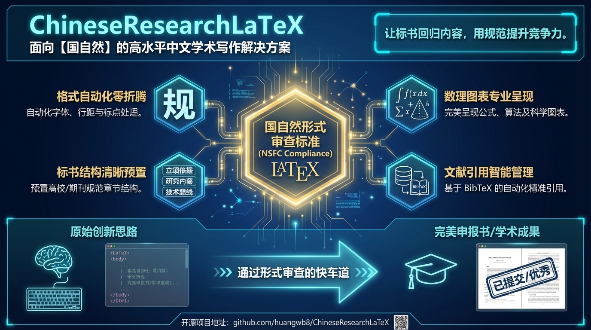

<div align="center">


# 中国科研常用 LaTeX 模板集

[](https://github.com/huangwb8/ChineseResearchLaTeX/releases)


</div>

---

<div align="center">

**[国自然正文模板（2026 就绪）](#模板列表) • [AI 技能](#相关资源) • [写作指南](#相关资源)**

为 Vibe Writing 做好准备！💡 创作不易，如果这个项目对您有帮助，请给个 ⭐ Star 持续关注！

</div>

---

## ✨ 概览

2024-2025 年，AI 辅助开发迎来了真正的范式转移。2023 年，[GitHub Copilot](https://github.com/features/copilot) 普及了 AI 代码补全，但 AI 仍处于"被动响应"角色。2024 年初，[Cursor](https://cursor.sh) 率先将 AI 转变为"主动协作伙伴"，引入 AI 原生开发环境。随后，[Manus](https://manus.im)、[Windsurf](https://windsurf.ai) 等产品持续推动多 Agent 协作和深度 IDE 集成。到了 2024 年末，[Claude Code](https://code.claude.com/docs/en/overview) 和 [OpenAI Codex CLI](https://developers.openai.com/codex/cli) 将这一理念带入命令行领域，实现了真正的"AI 作为第一公民"。这一演进背后的核心理念被称为 **Vibe Coding**——AI 不再是工具，而是合作伙伴。传统模式下，人类写代码、AI 补全，指令是单向的、生成是一次性的。而在 Vibe Coding 模式下，AI 主动规划并执行任务，人类负责监督和决策；双方通过双向对话持续迭代优化，AI 成为真正的"合作开发者"。

<h3>🔥 科研写作正从纯手工转向这种人机协作模式（我称之为 <strong>Vibe Writing</strong>）</h3>

AI 负责格式对齐、参考文献管理、章节重构等机械性工作，人类则专注研究设计、学术观点、创新提炼等创造性思维。为适应这一变革，本项目基于 Vibe Coding 理念重构：AI 智能分析模板结构并自动识别需要优化的样式模块，提出优化方案后由人类审核决策，AI 执行并自动编译测试，人类把控最终质量。同时，项目构建了可扩展的 Agent Skills 体系，支持灵活组合与升级，从而在"AI 辅助标书写作"这一任务里充分地压榨 AI 的智能。更重要的是，**斯坦福大学《2025年AI指数报告》显示 LLM 能力正以超越摩尔定律的速度指数级进化**，核心基准测试分数一年内飙升 67.3 个百分点，编码任务通过率从 4.4% 跃升至 71.7%——这意味着本项目的价值将随模型能力增长而持续放大，今天 AI 能帮你完成格式对齐，明天就能协助观点提炼和逻辑重构。**本项目的核心特性**：

- 🤖 **AI 驱动**：智能模板规划、自动样式对齐、代码审查测试
- 🧩 **模块化技能**：可扩展的 AI 技能体系，支持灵活组合与升级
- 👥 **人机协作**：AI 处理机械任务，人类聚焦创意与决策
- 🔬 **科研导向**：专为国自然标书等科研写作场景深度优化
- 🚀 **未来可期**：随 AI 能力指数级增长，项目价值持续放大

---

<div align="center">



</div>

## ⚠️ 免责和安全性声明

使用本项目前，**务必仔细阅读[完整声明文档](logo/SECURITY.md)**。请保证您在充分了解相关风险的情况下使用本项目。

---

## 👥 社区支持

欢迎加入项目微信群聊，与其他用户交流经验、分享心得！无论您是对以下哪个话题感兴趣，都欢迎扫码进群：

- 📚 **科研写作**：LaTeX 使用、论文写作、标书撰写
- 📝 **国自然标书**：申请经验、模板使用、格式优化
- 🤖 **AI Agents**：智能代理开发、技能体系搭建
- 🔌 **API 使用**：模型调用、API 配置、成本优化
- ✨ **Vibe Coding/Writing**：AI 辅助编程与写作，人机协作式创作

<div align="center">


</div>

> 💡 **温馨提示**：微信群主要用于经验交流和问题讨论，如需报告 Bug 或提交功能建议，请通过 [GitHub Issues](https://github.com/huangwb8/ChineseResearchLaTeX/issues) 提交，以便更好地跟踪和管理。

---

## 📋 模板列表

> ⚠️ **建议使用正式的 [Release 版本](https://github.com/huangwb8/ChineseResearchLaTeX/releases) 以获得最佳稳定性**。借助 [make_latex_model](skills/make_latex_model/) 技能，现已支持像素级 `Word/PDF 模板 → LaTeX 模板` 的快速转换，如有定制需求欢迎[提交 Issue](https://github.com/huangwb8/ChineseResearchLaTeX/issues)。 模板中的示例内容、章节结构、写作逻辑仅供参考，请务必根据您的研究主题和实际情况进行调整；同时，2026 年国自然模板可能存在较大调整，目前"2026 就绪"的模板基于往年版本推测，最终以基金委官方发布为准！

| 模板 | 状态 | Overleaf 演示 |
|------|------|---------------|
| [青年科学基金项目](projects/NSFC_Young/) | ✅ 2026 就绪 | [演示](https://www.overleaf.com/read/jchdzdmdkkpj#423009) |
| [面上项目](projects/NSFC_General/) | ✅ 2026 就绪 | [演示](https://www.overleaf.com/read/trpmsszhsyvt#c3eb06) |
| 地区科学基金项目 | ⏸️ 暂未更新，[有需要请提交 Issue](https://github.com/huangwb8/ChineseResearchLaTeX/issues) | ⏳ 待更新 |

---

## 🔗 镜像站

- **GitHub 源站**：[huangwb8/ChineseResearchLaTeX](https://github.com/huangwb8/ChineseResearchLaTeX)
- **Gitee 镜像**：[huangwb8/ChineseResearchLaTeX](https://gitee.com/huangwb8/ChineseResearchLaTeX)（方便中国大陆访问）

---

## 🚀 使用

### 环境要求

- **测试平台**：Windows / macOS / Overleaf
- **LaTeX 发行版**：TeX Live（推荐）或 MacTeX
- **编译器**：**必须使用 XeLaTeX**（Overleaf 上请在 Menu → Compiler 中选择 XeLaTeX）
- **编译顺序**：`xelatex -> bibtex -> xelatex -> xelatex`

### 推荐软件平台

- **VS Code + LaTeX Workshop**：本地开发的最佳选择，充分发挥 Vibe Coding 工具的超强能力
- **Claude Code / OpenAI Codex CLI**（VS Code 插件）：**最佳选择**，AI 辅助写作，与本项目的 AI 技能完美配合。VS Code 扩展市场搜索"Claude Code"或"OpenAI Codex"即可安装。macOS 已成为 AI 时代开发首选操作系统，体验最佳；Windows 用户建议使用 WSL（Windows Subsystem for Linux）环境以获得更稳定的性能
  - **Claude Code**：详见[安装教程](https://claudefa.st/blog/guide/installation-guide)
  - **Codex CLI**：详见[WSL 安装指南](https://1v0.dev/posts/25-openai-codexcli-wsl/) 或 [Ubuntu/WSL 配置教程](https://cdkagaya.design.blog/2025/10/16/install-and-configure-openai-codex-cli-on-ubuntu-wsl/)
- **Office Viewer**（VS Code 插件）：推荐安装，提供 Markdown 和 Word 文档的实时预览功能，提升文档编辑体验

> 💡 **说明**：由于在本地使用 Vibe Coding 的体验很好，因此**不推荐**在 Overleaf 等在线平台使用本模板。但本项目**会持续支持 Overleaf 平台**，用户可自由选择使用方式。

---

### AI 模型配置建议

| 工具 | 推荐模型 | 适用场景 |
|------|----------|----------|
| **Codex CLI** | GPT-5.2 High | 复杂任务、长上下文、高质量输出（速度较慢） |
| **Codex CLI** | GPT-5.2 Medium | 轻至中量调整、格式修复（指令遵循不错、全局把控力好） |
| **Claude Code** | Claude 4.5 Opus | 复杂任务、高质量输出（比较昂贵） |
| **Claude Code** | GLM-4.7 | 轻量调整、格式修复、快速迭代 |

### API 获取建议

> ⚠️ **重要说明**：以下推荐的均为第三方 API 中转服务商，非 OpenAI 或 Anthropic 官方 API。由于网络限制等原因，官方 API 在国内无法直接使用，这些中转服务提供了便捷的替代方案。同时，以下商家均支持发票报销，干科研就不用自己花钱了吧 (～￣▽￣)～ 

- **稳定高质量**：推荐使用 [我的专属邀请链接](https://x.dogenet.win/i/kUOGvGyo) 获取稳定、高质量的 API 服务。如果您累计充值满4美元（约 20 元人民币）后填写邀请码，我们均可获得 20 美元 ClaudeCode 专用抵扣额度。此额度仅能通过[指定活动端点](https://apic1.ohmycdn.com/api/v1/ai/openai/cc-omg)使用，额度有效期为 60 天。🔥 **最新动态**：Cerebras 推出新模型 `zai-glm-4.7`，现开放免费及开发者版本，将于 2026 年 1 月 20 日起替代旧版 GLM-4.7
- **性价比之选**：可考虑 [DMXAPI](https://www.dmxapi.cn/register?aff=HIeH)（LangChain 中文网提供的 API 聚合平台）。通常可做到海外模型约 **6-7 折/约 70-80% 官方价**，支持**专票/普票**与**公对公转账**等企业报销需求；平台运营相对透明（有运营日志与接口状态监控）。注意高峰期可能出现 429 限流或个别模型不稳定，建议先小额测试，并保留官方/备用方案。
- **Codex 平价拼车**：可考虑 [Packycode 的 Codex 站](https://codex.packycode.com)（日/周/月限额度）。登录/服务相对原始，偏 Team 账号拼车；实测使用 1 个多月整体较稳，个人开发基本够用。价格优势明显；发票需联系站长办理（相对麻烦），但支持对公报销是巨大优势。
- **GLM-4.7 超值拼车**：可考虑在闲鱼搜索"GLM-4.7 coding plan max"拼车服务，价格约 **30-40 元/月**，性价比极高。量大管饱，用到天昏地暗都用不完，完全没有 token 焦虑。适合轻量任务和快速迭代场景。若追求更高稳定性，也可直接使用[智谱 AI 官方 API](https://open.bigmodel.cn/)，支持企业报销，价格相对较高但服务质量有保障

---

## 🤖 Skills

项目内置多个符合 [我预定义规范](https://github.com/huangwb8/skills) 的强大 Skills，辅助 LaTeX 写作和模板优化。**兼容 Claude Code、OpenAI Codex、Cursor、GitHub Actions、VS Code！**

> 💡 **快速安装**：打开 Claude Code 或 Codex 后，输入以下 Prompt：
> ```
> 下载 https://github.com/huangwb8/skills/tree/main/install-bensz-skills 到本项目的 skills 文件夹里，然后使用 install-bensz-skills 将本项目的 skills 安装到本设备的 Codex 和 Claude Code 里。
> ```

| 技能 | 类型 | 功能 | 状态 |
|------|------|------|------|
| [make_latex_model](skills/make_latex_model/) | 🔧 开发 | 基于 Word 模板高保真优化 LaTeX 样式 | ✅ 稳定 |
| [complete_example](skills/complete_example/) | 🔧 开发 | 智能示例生成和补全 | ✅ 稳定 |
| [transfer_old_latex_to_new](skills/transfer_old_latex_to_new/) | 📝 日常 | 将旧标书内容迁移到新模板 | ✅ 稳定 |
| [systematic-literature-review](skills/systematic-literature-review/) | 📝 日常 | 令人印象深刻的精准、全面的专家级综述 | ✅ 稳定 |
| [nsfc-justification-writer](skills/nsfc-justification-writer/) | 📝 日常 | NSFC 立项依据写作 | 🚧 开发中 |
| [nsfc-research-content-writer](skills/nsfc-research-content-writer/) | 📝 日常 | NSFC 研究内容编排写作 | 🚧 开发中 |
| [nsfc-research-foundation-writer](skills/nsfc-research-foundation-writer/) | 📝 日常 | NSFC 研究基础编排写作 | 🚧 开发中 |

> 📖 **详细使用说明和 Prompt 模板**：请查阅 [skills/README.md](skills/README.md)

---

## 💝 捐赠

开发和维护这些 LaTeX 模板需要大量时间和精力 😓,**您的捐赠将帮助我持续优化模板和 AI 技能、快速响应问题和 Bug 修复、开发新的科研写作辅助功能,以及保持项目的长期维护和更新**。如果本项目对您有帮助,欢迎捐赠支持我的开发工作! 🙏

<div align="center">


</div>

---

## 👨‍💻 维护者

[@huangwb8](https://blognas.hwb0307.com/lyb)

---

## ©️ 许可证

本项目采用 [MIT License](license.txt)。

---

## 🤝 商务合作

**智谱 AI** 的 **GLM-4.7** 模型凭借出色的编码能力和推理性能，为项目的 Vibe Coding 实践提供了极大助力，我们诚挚邀请智谱清言团队及各类 AI 服务商、云服务提供商、科研机构等相关方洽谈合作与赞助事宜，具体合作方式包括但不限于：

- 💰 **项目赞助**：资金、API 额度、云服务资源等
- 🎯 **技术合作**：联合开发、技术支持、模型优化等
- 📢 **品牌推广**：品牌露出、案例展示、联合活动等
- 🔬 **科研合作**：论文撰写、数据标注、模型评估等

如有合作意向，欢迎通过 [GitHub Issues](https://github.com/huangwb8/ChineseResearchLaTeX/issues) 或[维护者博客](https://blognas.hwb0307.com)联系。

---

## 📚 相关资源

### 指南与教程

> 💡 **提示**：深入了解 AI 辅助编程和 Vibe Coding 理念，推荐阅读上述博客文章（如果您是初次接触，建议按顺序阅读以循序渐进地了解 Vibe Coding 生态）

- [LaTeX 写作指南](references/latex-writing-guide.md)：科研论文写作最佳实践
- [博客文章](https://blognas.hwb0307.com/skill/5762) ：国家自然科学基金 LaTeX 模板详解
- [Vibe Coding CLI 评测：Claude Code vs. OpenAI Codex vs.Gemini CLI](https://blognas.hwb0307.com/other/6923) - 全面对比三大 CLI AI 编程助手（2026-01-06）
- [AI 模型评测：性价比超绝的 GLM-4.7](https://blognas.hwb0307.com/ai/6914) - 智谱 AI 开源模型的编码能力与推理性能分析（2026-01-05）
- [Claude Code 和 Claude Skills 的工程设计](https://blognas.hwb0307.com/skill/6689) - 深入探讨 Skills 本质与系统化开发流程（2026-01-03）
- [AI 应用系列：一个简单的 Vibe Coding 通知系统](https://blognas.hwb0307.com/ai/6659) - VibeNotification 项目实战经验（2025-12-21）

### 相关仓库

- [Ruzim/NSFC-application-template-latex](https://github.com/Ruzim/NSFC-application-template-latex)
- [Readon/NSFC-application-template-latex](https://github.com/Readon/NSFC-application-template-latex)
- [MCG-NKU/NSFC-LaTex](https://github.com/MCG-NKU/NSFC-LaTex)
- [fylimas/nsfc](https://github.com/fylimas/nsfc)：活跃更新的国自然模板
- [YimianDai/iNSFC](https://github.com/YimianDai/iNSFC)：MacTeX 和 Overleaf 通用模板
