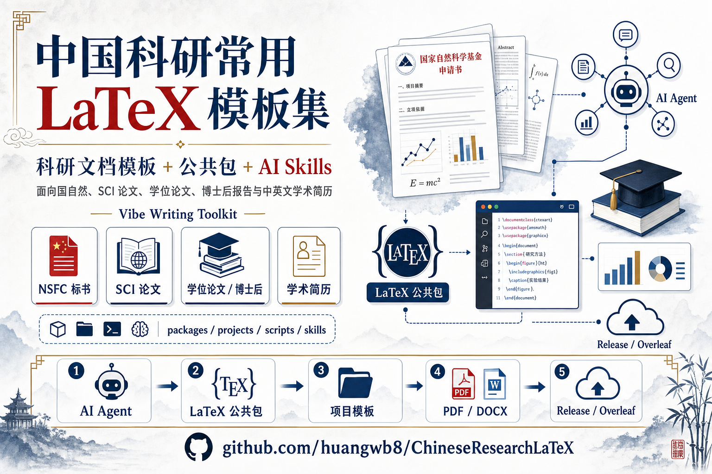

<div align="center">


# 中国科研常用 LaTeX 模板集

[](https://github.com/huangwb8/ChineseResearchLaTeX/releases)


</div>

---

<div align="center">


<h3><strong>🤝 打造最适合中国研究者的科研文档 AI Agent，让天下没有难写的国自然标书、SCI 论文、毕业论文、学术简历！🚀</strong></h3>

我们备受关注：

<picture>
  <source media="(prefers-color-scheme: dark)" srcset="https://api.star-history.com/svg?repos=huangwb8/ChineseResearchLaTeX&type=Date&theme=dark" />
  
</picture>

</div>

<h3><strong>2026年国自然基金申请基本已经收尾。v4是为2027年及以后的国自然申请做准备。如果您有2026年申请的需要，请使用v3。不便之处，敬请谅解！</strong></h3>

---

## ⚠️ 免责和安全性声明

使用本项目前，**务必仔细阅读[完整声明文档](logo/SECURITY.md)**。请保证您在充分了解相关风险的情况下使用本项目。

如果您确定使用本项目，必须先拥有足够的AI算力。 具体见我的博客文章： [AI入门系列 如何获得vibe coding相关的AI算力 - Bensz](https://blognas.hwb0307.com/ai/7008)。

创作不易，如果这个项目对您有帮助，请转发、种草、 ⭐ Star、或者捐赠我们，感谢支持！

---

## ✨ 概览

2024-2025 年，AI 辅助开发迎来了真正的范式转移。2023 年，[GitHub Copilot](https://github.com/features/copilot) 普及了 AI 代码补全，但 AI 仍处于"被动响应"角色。2024 年初，[Cursor](https://cursor.sh) 率先将 AI 转变为"主动协作伙伴"，引入 AI 原生开发环境。随后，[Manus](https://manus.im)、[Windsurf](https://windsurf.ai) 等产品持续推动多 Agent 协作和深度 IDE 集成。到了 2024 年末，[Claude Code](https://code.claude.com/docs/en/overview) 和 [OpenAI Codex CLI](https://developers.openai.com/codex/cli) 将这一理念带入命令行领域，实现了真正的"AI 作为第一公民"。这一演进背后的核心理念被称为 **Vibe Coding**——AI 不再是工具，而是合作伙伴。传统模式下，人类写代码、AI 补全，指令是单向的、生成是一次性的。而在 Vibe Coding 模式下，AI 主动规划并执行任务，人类负责监督和决策；双方通过双向对话持续迭代优化，AI 成为真正的"合作开发者"。

<h3>🔥 科研写作正从纯手工转向这种人机协作模式（我称之为 <strong>Vibe Writing</strong>）</h3>

AI 负责格式对齐、参考文献管理、章节重构、中英双语内容同步等机械性工作，人类则专注研究设计、学术观点、创新提炼等创造性思维。为适应这一变革，本项目基于 Vibe Coding 理念重构：AI 智能分析模板结构并自动识别需要优化的样式模块，提出优化方案后由人类审核决策，AI 执行并自动编译测试，人类把控最终质量。同时，项目构建了可扩展的 Agent Skills 体系，支持灵活组合与升级，从而在"AI 辅助科研写作与科研表达"这一任务里充分地压榨 AI 的智能。更重要的是，**斯坦福大学《2025年AI指数报告》显示 LLM 能力正以超越摩尔定律的速度指数级进化**，核心基准测试分数一年内飙升 67.3 个百分点，编码任务通过率从 4.4% 跃升至 71.7%——这意味着本项目的价值将随模型能力增长而持续放大，今天 AI 能帮你完成格式对齐，明天就能协助观点提炼、逻辑重构与对外展示材料整理。

**本项目的核心特性**：

- 🤖 **AI 驱动**：智能模板规划、自动样式对齐、代码审查测试
- 🧩 **模块化技能**：可扩展的 AI 技能体系，支持灵活组合与升级
- 👥 **人机协作**：AI 处理机械任务，人类聚焦创意与决策
- 🔬 **科研导向**：专为国自然标书、SCI 论文、毕业论文、学术简历等科研文档场景深度优化
- 🚀 **未来可期**：随 AI 能力指数级增长，项目价值持续放大

<div align="center">



</div>

---

## 👥 社区支持

> 💡 **温馨提示**：如需报告 Bug 或提交功能建议，请通过 [GitHub Issues](https://github.com/huangwb8/ChineseResearchLaTeX/issues) 提交，以便更好地跟踪和管理。
> 🛠️ **开发者协作**：如需贡献代码、模板或脚本，请先阅读 [开发者贡献规范](docs/developer-contribution-guide.md)。本项目默认采用“先提 Issue、获维护者确认后再提 PR”的流程。

欢迎关注 [Bensz Channel](https://channel.hwb0307.com)，与其他用户交流经验、分享心得！无论您是对以下哪个话题感兴趣，都欢迎扫码加入：

- 📚 **科研写作**：LaTeX 使用、论文写作、标书撰写
- 📝 **国自然标书**：申请经验、模板使用、格式优化
- 🤖 **AI Agents**：智能代理开发、技能体系搭建
- 🔌 **API 使用**：模型调用、API 配置、成本优化
- ✨ **Vibe Coding/Writing**：AI 辅助编程与写作，人机协作式创作

另外，我们还有非常详尽、免费的视频/文字教程，请按需食用：

- [合集·国自然与Vibe Coding](https://space.bilibili.com/24478261/lists/7373060)
- [合集·Bensz Vibe Coding实用教程](https://space.bilibili.com/24478261/lists/7362584?type=season)
- [国家自然科学基金的LaTeX模板](https://blognas.hwb0307.com/skill/5762)
- [国家自然科学基金的LaTeX模板 第2期](https://blognas.hwb0307.com/skill/6930)

---

## 🔗 镜像站

- **GitHub 源站**：[huangwb8/ChineseResearchLaTeX](https://github.com/huangwb8/ChineseResearchLaTeX)
- **Gitee 镜像**：[huangwb8/ChineseResearchLaTeX](https://gitee.com/huangwb8/ChineseResearchLaTeX)（方便中国大陆访问）

---

## 📋 模板列表

<!-- TEMPLATE-LIST:START -->
<!-- 由 scripts/update_readme_template_list.py 自动生成，请勿手动编辑。 -->
> ⚠️ **建议优先使用下表中的最新正式 zip 下载包。** 该列表由 GitHub Actions 每小时自动检查一次，也支持手动触发同步。
> 当前同步源：`huangwb8/ChineseResearchLaTeX@v4.0.18`，发布时间：2026-06-11 10:44（UTC+8）。

### NSFC 模板

> 当前主线，优先面向正式申报与 Overleaf 打包分发。

| 模板 | 状态 | 标准包 | Overleaf 包 |
|------|------|--------|-------------|
| [青年 C](projects/NSFC_Young/) | ✅ 已发布 | [下载](https://github.com/huangwb8/ChineseResearchLaTeX/releases/download/v4.0.18/NSFC_Young-v4.0.18.zip)（2.24 MB） | [下载](https://github.com/huangwb8/ChineseResearchLaTeX/releases/download/v4.0.18/NSFC_Young-Overleaf-v4.0.18.zip)（7.85 MB） |
| [面上](projects/NSFC_General/) | ✅ 已发布 | [下载](https://github.com/huangwb8/ChineseResearchLaTeX/releases/download/v4.0.18/NSFC_General-v4.0.18.zip)（0.96 MB） | [下载](https://github.com/huangwb8/ChineseResearchLaTeX/releases/download/v4.0.18/NSFC_General-Overleaf-v4.0.18.zip)（7.22 MB） |
| [地区](projects/NSFC_Local/) | ✅ 已发布 | [下载](https://github.com/huangwb8/ChineseResearchLaTeX/releases/download/v4.0.18/NSFC_Local-v4.0.18.zip)（2.26 MB） | [下载](https://github.com/huangwb8/ChineseResearchLaTeX/releases/download/v4.0.18/NSFC_Local-Overleaf-v4.0.18.zip)（7.90 MB） |

### 广东省自然科学基金模板

> 项目层独立模板，面向广东省自然科学基金面上项目报告正文。

| 模板 | 状态 | 标准包 | Overleaf 包 |
|------|------|--------|-------------|
| [广东省面上](projects/GDNSF_General/) | ✅ 已发布 | [下载](https://github.com/huangwb8/ChineseResearchLaTeX/releases/download/v4.0.18/GDNSF_General-v4.0.18.zip)（0.14 MB） | [下载](https://github.com/huangwb8/ChineseResearchLaTeX/releases/download/v4.0.18/GDNSF_General-Overleaf-v4.0.18.zip)（30.1 MB） |

### SCI 论文模板

> 公共包 + 示例项目已落地，支持 PDF / DOCX 双输出。
> SCI 模板通常需要按期刊规范或既有 Word 稿件做个性化定制；如有这类需求，建议提交 [SCI 论文模板定制需求](https://github.com/huangwb8/ChineseResearchLaTeX/issues/new?template=paper-template-customization.yml)。

| 模板 | 状态 | 标准包 | Overleaf 包 |
|------|------|--------|-------------|
| [paper-coverletter-01](projects/paper-coverletter-01/) | ✅ 已发布 | [下载](https://github.com/huangwb8/ChineseResearchLaTeX/releases/download/v4.0.18/paper-coverletter-01-v4.0.18.zip)（0.30 MB） | [下载](https://github.com/huangwb8/ChineseResearchLaTeX/releases/download/v4.0.18/paper-coverletter-01-Overleaf-v4.0.18.zip)（0.01 MB） |
| [paper-sci-01](projects/paper-sci-01/) | ✅ 已发布 | [下载](https://github.com/huangwb8/ChineseResearchLaTeX/releases/download/v4.0.18/paper-sci-01-v4.0.18.zip)（0.38 MB） | [下载](https://github.com/huangwb8/ChineseResearchLaTeX/releases/download/v4.0.18/paper-sci-01-Overleaf-v4.0.18.zip)（0.02 MB） |

### 学位论文 / 博士后模板

> 公共包 + 示例项目已落地，支持 PDF 输出与像素级验收。
> 毕业论文/博士后模板通常需要按学校、学院或类型规范做个性化定制；如有这类需求，建议提交 [毕业论文模板定制需求](https://github.com/huangwb8/ChineseResearchLaTeX/issues/new?template=thesis-template-customization.yml)。

| 模板 | 院校 | 类型 | 标准包 | Overleaf 包 |
|------|------|------|--------|-------------|
| [thesis-ahnu-master](projects/thesis-ahnu-master/) | 安徽师范大学 | 硕士 | [下载](https://github.com/huangwb8/ChineseResearchLaTeX/releases/download/v4.0.18/thesis-ahnu-master-v4.0.18.zip)（0.34 MB） | [下载](https://github.com/huangwb8/ChineseResearchLaTeX/releases/download/v4.0.18/thesis-ahnu-master-Overleaf-v4.0.18.zip)（0.05 MB） |
| [thesis-hit-doctor](projects/thesis-hit-doctor/) | 哈尔滨工业大学 | 博士 | [下载](https://github.com/huangwb8/ChineseResearchLaTeX/releases/download/v4.0.18/thesis-hit-doctor-v4.0.18.zip)（0.30 MB） | [下载](https://github.com/huangwb8/ChineseResearchLaTeX/releases/download/v4.0.18/thesis-hit-doctor-Overleaf-v4.0.18.zip)（0.02 MB） |
| [thesis-jlau-doctor](projects/thesis-jlau-doctor/) | 吉林农业大学 | 博士 | [下载](https://github.com/huangwb8/ChineseResearchLaTeX/releases/download/v4.0.18/thesis-jlau-doctor-v4.0.18.zip)（1.18 MB） | [下载](https://github.com/huangwb8/ChineseResearchLaTeX/releases/download/v4.0.18/thesis-jlau-doctor-Overleaf-v4.0.18.zip)（0.47 MB） |
| [thesis-jlau-master](projects/thesis-jlau-master/) | 吉林农业大学 | 硕士 | [下载](https://github.com/huangwb8/ChineseResearchLaTeX/releases/download/v4.0.18/thesis-jlau-master-v4.0.18.zip)（1.18 MB） | [下载](https://github.com/huangwb8/ChineseResearchLaTeX/releases/download/v4.0.18/thesis-jlau-master-Overleaf-v4.0.18.zip)（0.46 MB） |
| [thesis-just-bachelor](projects/thesis-just-bachelor/) | 江苏科技大学 | 学士 | [下载](https://github.com/huangwb8/ChineseResearchLaTeX/releases/download/v4.0.18/thesis-just-bachelor-v4.0.18.zip)（1.40 MB） | [下载](https://github.com/huangwb8/ChineseResearchLaTeX/releases/download/v4.0.18/thesis-just-bachelor-Overleaf-v4.0.18.zip)（0.58 MB） |
| [thesis-nju-master](projects/thesis-nju-master/) | 南京大学 | 硕士 | [下载](https://github.com/huangwb8/ChineseResearchLaTeX/releases/download/v4.0.18/thesis-nju-master-v4.0.18.zip)（1.90 MB） | [下载](https://github.com/huangwb8/ChineseResearchLaTeX/releases/download/v4.0.18/thesis-nju-master-Overleaf-v4.0.18.zip)（1.24 MB） |
| [thesis-nwu-doctor](projects/thesis-nwu-doctor/) | 西北大学 | 博士 | [下载](https://github.com/huangwb8/ChineseResearchLaTeX/releases/download/v4.0.18/thesis-nwu-doctor-v4.0.18.zip)（0.99 MB） | [下载](https://github.com/huangwb8/ChineseResearchLaTeX/releases/download/v4.0.18/thesis-nwu-doctor-Overleaf-v4.0.18.zip)（0.35 MB） |
| [thesis-smu-master](projects/thesis-smu-master/) | 南方医科大学 | 硕士 | [下载](https://github.com/huangwb8/ChineseResearchLaTeX/releases/download/v4.0.18/thesis-smu-master-v4.0.18.zip)（0.54 MB） | [下载](https://github.com/huangwb8/ChineseResearchLaTeX/releases/download/v4.0.18/thesis-smu-master-Overleaf-v4.0.18.zip)（0.18 MB） |
| [thesis-smu-postdoc](projects/thesis-smu-postdoc/) | 南方医科大学 | 博士后 | [下载](https://github.com/huangwb8/ChineseResearchLaTeX/releases/download/v4.0.18/thesis-smu-postdoc-v4.0.18.zip)（0.41 MB） | [下载](https://github.com/huangwb8/ChineseResearchLaTeX/releases/download/v4.0.18/thesis-smu-postdoc-Overleaf-v4.0.18.zip)（0.08 MB） |
| [thesis-sysu-doctor](projects/thesis-sysu-doctor/) | 中山大学 | 博士 | [下载](https://github.com/huangwb8/ChineseResearchLaTeX/releases/download/v4.0.18/thesis-sysu-doctor-v4.0.18.zip)（0.55 MB） | [下载](https://github.com/huangwb8/ChineseResearchLaTeX/releases/download/v4.0.18/thesis-sysu-doctor-Overleaf-v4.0.18.zip)（0.63 MB） |
| [thesis-ucas-doctor](projects/thesis-ucas-doctor/) | 中国科学院大学 | 博士 | [下载](https://github.com/huangwb8/ChineseResearchLaTeX/releases/download/v4.0.18/thesis-ucas-doctor-v4.0.18.zip)（0.41 MB） | [下载](https://github.com/huangwb8/ChineseResearchLaTeX/releases/download/v4.0.18/thesis-ucas-doctor-Overleaf-v4.0.18.zip)（0.53 MB） |

### 简历模板

> 公共包 + 示例项目已落地，支持中英文 PDF 输出与像素级验收。

| 模板 | 状态 | 标准包 | Overleaf 包 |
|------|------|--------|-------------|
| [cv-01](projects/cv-01/) | ✅ 已发布 | [下载](https://github.com/huangwb8/ChineseResearchLaTeX/releases/download/v4.0.18/cv-01-v4.0.18.zip)（1.99 MB） | [下载](https://github.com/huangwb8/ChineseResearchLaTeX/releases/download/v4.0.18/cv-01-Overleaf-v4.0.18.zip)（38.6 MB） |
<!-- TEMPLATE-LIST:END -->

---

## 🚀 环境

### LaTex版本

- **测试平台**：Windows / macOS / Overleaf
- **LaTeX 发行版**：TeX Live（推荐）或 MacTeX
- **编译器**：**必须使用 XeLaTeX**（Overleaf 上请在 Menu → Compiler 中选择 XeLaTeX）
- **编译顺序**：`xelatex -> bibtex -> xelatex -> xelatex`

### 工作软件

- **VS Code + LaTeX Workshop**：本地开发的最佳选择，充分发挥 Vibe Coding 工具的超强能力
- `projects/` 下每个示例项目都自带与目录同名的 `*.code-workspace`、`.vscode/settings.json` 与项目级 `scripts/latex_workshop_build.lua`；本地开发时，建议直接用该工作区文件打开项目，让 LaTeX Workshop 通过 `texlua` 自动转调项目内置的 Python 构建 wrapper
- **Claude Code / OpenAI Codex CLI**（VS Code 插件）：**最佳选择**，AI 辅助写作，与本项目的 AI 技能完美配合。VS Code 扩展市场搜索"Claude Code"或"OpenAI Codex"即可安装。macOS 已成为 AI 时代开发首选操作系统，体验最佳；Windows 用户建议使用 WSL（Windows Subsystem for Linux）环境以获得更稳定的性能。
- 由于在本地使用 Vibe Coding 的体验很好，因此**不推荐**在 Overleaf 等在线平台使用本模板。但本项目**仍会持续支持 Overleaf 平台**，以满足一些小众用户的需求。
- Overleaf 专用 zip 会将公共包运行时统一整理到项目根目录下的 `styles/`，并裁剪掉 VS Code 配置、构建脚本、示例 PDF/DOCX、Word 模板与其它非当前模板必需文件，保证结构更干净、上传后更直接。

### AI 模型配置建议

| 适用场景 | Codex CLI | Claude Code |
|----------|-----------|-------------|
| 执行计划、复杂任务、长上下文、多文件重构、架构决策 | GPT-5.5 High/xHigh | **Claude Opus 4.8** · Effort `high`/`xhigh` · Thinking 开<br>**GLM-5.2** · Thinking 开（性价比主力） |
| 规划计划、中等复杂度调整、全局把控 | GPT-5.5 Medium | **GLM-5.2** · Thinking 开 |
| 轻至中量调整、格式修复 | GPT-5.5 Medium | **GLM-5.2** · Thinking 关 |
| Git-commit、简单任务 | GPT-5.5 Medium | **GLM-5.2** · Thinking 关 |


---

## 🤖 LaTeX 包安装

> 依赖配置 Python 3 环境

本项目 [`packages/`](https://github.com/huangwb8/ChineseResearchLaTeX/tree/main/packages) 目录维护了以下可安装的 LaTeX 公共包，支持指定 1 个或多个包安装：

| 包名 | 说明 |
|------|------|
| `bensz-fonts` | 共享字体基础包——集中托管字体资产并提供统一字体 API |
| `bensz-nsfc` | NSFC 公共包——三套国自然模板的共享样式基础 |
| `bensz-paper` | SCI 论文公共包——支持 PDF / DOCX 双输出 |
| `bensz-thesis` | 毕业论文公共包——支持硕士/博士论文模板、DOCX 初稿导出与像素级验收脚本 |
| `bensz-cv` | 学术简历公共包——支持中英文简历模板与像素级验收脚本 |


在 **Claude Code** 或 **OpenAI Codex** 中输入以下 Prompt

```
安装 https://github.com/huangwb8/ChineseResearchLaTeX/tree/main/packages 里所有的包（最新稳定版）。
```

AI 会自动联网访问项目文档了解安装方式并完成安装。小白专用，省力省心！

> 💡 需要手动控制安装路径、镜像源、版本 tag、覆盖安装，或在无 AI 环境下部署？高级用户请参考 [手动配置指南](docs/manual-setup-guide.md#latex-公共包安装)。

## 🤖 LaTeX 模板编译

在 **Claude Code** 或 **OpenAI Codex** 中输入以下 Prompt，AI 会自动调用对应的官方构建脚本完成 PDF / DOCX 双输出与字数统计：

```
# 编译 PDF（适用于 NSFC / SCI / 学位论文 / 简历 等所有 projects/*）
编译 projects/NSFC_Young 的 PDF

# 导出 Word 文档（适用于 paper-* / thesis-*）
导出 projects/paper-sci-01 的 Word 文档

# 统计可见字数（适用于 paper-*）
统计 projects/paper-sci-01 各章节的可见字数
```

> 💡 需要 `build` / `docx` / `count-words` / `compare` 等子命令的精确参数、各产品线 wrapper 入口，或退回原生 `xelatex → bibtex → xelatex → xelatex` 排查？见 [手动配置指南](docs/manual-setup-guide.md#latex-模板编译)。

---

## 🤖 Skills

> ⚠️ 注意：标记为 `🚧 开发中` 的 skill 暂时不建议小白用户使用，因为它们往往还没有被充分地测试，功能和安全性没有保障。与标书模板不同，Skills建议直接使用仓库里最新的版本。

项目内置多个符合 [我预定义规范](https://github.com/huangwb8/skills) 的强大 Skills，辅助 LaTeX 写作和模板优化。**兼容 Claude Code、OpenAI Codex、Cursor、GitHub Actions、VS Code！** 通过灵活运用 skills，加上多轮对话进行优化，才能保证最佳效果。**详细使用说明和 Prompt 模板**：[skills/README.md](skills/README.md)

在 **Claude Code** 或 **OpenAI Codex** 中输入以下 Prompt，AI 会自动拉取官方一键脚本完成安装与更新：

```
安装/更新 huangwb8/skills 的 bensz skills 到最新版
```

> 💡 需要一键 `curl | bash` / `irm | iex`、本地 `git clone` 或远程对话式安装等手动命令？见 [手动配置指南](docs/manual-setup-guide.md#skills-安装与更新)。


本项目提供多个 AI 技能，覆盖文献调研、模板迁移、标书写作与模板开发等协作场景。

说明：
- 新任务、新文档和新脚本请统一使用当前名称；旧名称只作为存量 Prompt 的兼容入口
- `make-latex-model` 取代旧写法 `make_latex_model`
- `transfer-old-latex-to-new` 取代历史别名 `migrating-latex-templates`
- 下表版本号为当前仓库内各 `skills/*/config.yaml` 的同步快照；若后续单个 skill 独立升级，以对应 `config.yaml` 与该 skill 自身 `README.md` 为准

| 技能 | 阶段 | 版本 | 功能 | 状态 |
|------|------|------|------|------|
| [make-latex-model](skills/make-latex-model/) | 🔧 模板开发 | v3.1.2 | 面向 ChineseResearchLaTeX 全仓库的模板落地与高保真对齐 | ✅ 稳定 |
| [complete-example](skills/complete-example/) | 🔧 模板开发 | v1.4.1 | 智能示例生成和补全 | ✅ 稳定 |
| [transfer-old-latex-to-new](skills/transfer-old-latex-to-new/) | 🔧 模板开发  | v2.1.0 | 模板迁移与重构编排，支持任意输入并由 AI 自主决定输出 | ✅ 稳定 |
| [research-literature-review](skills/research-literature-review/) | 📚 文献调研 | v1.1.0 | 令人印象深刻的精准、全面的专家级综述 | ✅ 稳定 |
| [research-citation-check](skills/research-citation-check/) | 📚 文献调研 | v1.1.0 | 综述引用语义一致性检查 | ✅ 稳定 |
| [research-topic-extractor](skills/research-topic-extractor/) | 📚 文献调研 | v1.1.0 | 结构化综述主题提取 | ✅ 稳定 |
| [research-guide-updater](skills/research-guide-updater/) | 📚 文献调研 | v1.1.0 | 项目指南优化与写作规范沉淀 | ✅ 稳定 |
| [research-plan](skills/research-plan/) | 📚 文献调研 | v0.2.0 | 文献驱动的科研分析策略规划 | 🚧 开发中 |
| [research-idea](skills/research-idea/) | 📚 文献调研 | v0.2.0 | 基于查新与多轮独立审查提出科学问题和可证伪假设 | 🚧 开发中 |
| [nsfc-code](skills/nsfc-code/) | ✍️ 标书写作 | v1.0.0 | NSFC 申请代码推荐（5 组 code1/code2 + 理由，只读） | ✅ 稳定 |
| [nsfc-abstract](skills/nsfc-abstract/) | ✍️ 标书写作 | v2.1.2 | 标题建议 + NSFC 中英文摘要生成（中文≤400字；英文≤4000字符） | ✅ 稳定 |
| [nsfc-budget](skills/nsfc-budget/) | ✍️ 标书写作 | v0.1.2 | NSFC 预算说明书生成（LaTeX 项目 + `budget.pdf`） | 🚧 开发中 |
| [nsfc-justification-writer](skills/nsfc-justification-writer/) | ✍️ 标书写作 | v1.0.0 | 理论创新导向的立项依据写作 | ✅ 稳定 |
| [nsfc-research-content-writer](skills/nsfc-research-content-writer/) | ✍️ 标书写作 | v1.0.0 | NSFC 研究内容编排写作 | ✅ 稳定 |
| [nsfc-research-foundation-writer](skills/nsfc-research-foundation-writer/) | ✍️ 标书写作 | v0.1.2 | NSFC 研究基础编排写作 | 🚧 开发中 |
| [nsfc-qc](skills/nsfc-qc/) | ✍️ 标书写作 | v1.2.0 | NSFC 标书只读质量控制（多线程检查文风/引用/篇幅/逻辑 + 全文级缩写注册表 QC） | ✅ 稳定 |
| [nsfc-ref-alignment](skills/nsfc-ref-alignment/) | ✍️ 标书写作 | v0.1.1 | NSFC 参考文献与正文引用一致性核查（只读） | 🚧 开发中 |
| [nsfc-reviewers](skills/nsfc-reviewers/) | ✍️ 标书写作 | v1.4.0 | NSFC 标书多专家多维度评审模拟（默认 3 组、最多 5 组，含函评/会评给不过判断与资助约束识别） | ✅ 稳定 |
| [nsfc-length-aligner](skills/nsfc-length-aligner/) | ✍️ 标书写作 | v0.3.1 | NSFC 标书篇幅对齐（检查差距 → 扩写/压缩到达标） | 🚧 开发中 |
| [nsfc-humanization](skills/nsfc-humanization/) | ✍️ 标书写作 | v1.1.1 | 去 AI 机器味，默认采用 aggressive 强度弱化模板化转折、抽象概念堆叠和边界声明过重 | ✅ 稳定 |
| [paper-write-sci](skills/paper-write-sci/) | 📝 SCI 论文 | v0.11.2 | SCI 期刊论文写作与修订（风格化写作、数字审查、逻辑审查、写作节奏护栏、PDF/Word 渲染闭环） | 🚧 开发中 |
| [paper-explain-figures](skills/paper-explain-figures/) | 📝 SCI 论文 | v0.2.0 | 解读论文 Figure 含义，生成高可读性 Markdown 报告（视觉理解 + 源代码检索 + 人工解读） | 🚧 开发中 |
| [paper-select-journal](skills/paper-select-journal/) | 📝 SCI 论文 | v0.3.1 | SCI 投稿期刊筛选（稿件画像 + 期刊核验 + 近 3 个月相似论文证据） | 🚧 开发中 |
| [paper-know-journal](skills/paper-know-journal/) | 📝 SCI 论文 | v0.3.0 | 期刊投稿指南调研（官方作者指南、投稿形式要求、费用政策与社区评价） | 🚧 开发中 |

---

## 👨‍💻 维护者

[@huangwb8](https://blognas.hwb0307.com/lyb)

---

## ©️ 许可证

本项目采用 [MIT License](license.txt)。

---

## 🤝 商务合作

我们诚挚邀请智谱清言团队及各类 AI 服务商、云服务提供商、科研机构等相关方洽谈合作与赞助事宜，具体合作方式包括但不限于：

- 💰 **项目赞助**：资金、API 额度、云服务资源等
- 🎯 **技术合作**：联合开发、技术支持、模型优化等
- 📢 **品牌推广**：品牌露出、案例展示、联合活动等
- 🔬 **科研合作**：论文撰写、数据标注、模型评估等

如有合作意向，欢迎通过 [GitHub Issues](https://github.com/huangwb8/ChineseResearchLaTeX/issues) 或[维护者博客](https://blognas.hwb0307.com)联系。

---

## 📚 相关资源

### 指南与教程

> 💡 **提示**：深入了解 AI 辅助编程和 Vibe Coding 理念，推荐阅读上述博客文章（如果您是初次接触，建议按顺序阅读以循序渐进地了解 Vibe Coding 生态）

- [学习地图 - Bensz](https://blognas.hwb0307.com/map)： `技术版 - AI系列 - 教程`小节。当然，这里还有其它学习资源，大家可以按需食用！

### 相关仓库

- [Ruzim/NSFC-application-template-latex](https://github.com/Ruzim/NSFC-application-template-latex)
- [Readon/NSFC-application-template-latex](https://github.com/Readon/NSFC-application-template-latex)
- [MCG-NKU/NSFC-LaTex](https://github.com/MCG-NKU/NSFC-LaTex)
- [fylimas/nsfc](https://github.com/fylimas/nsfc)：活跃更新的国自然模板
- [YimianDai/iNSFC](https://github.com/YimianDai/iNSFC)：MacTeX 和 Overleaf 通用模板
