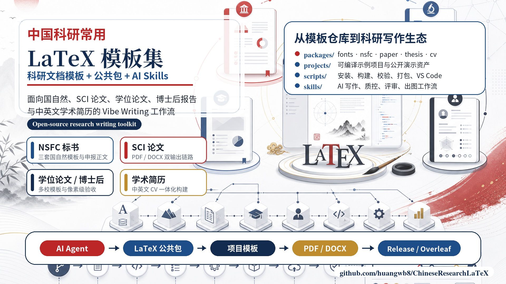

<div align="center">


# 中国科研常用 LaTeX 模板集

[](https://github.com/huangwb8/ChineseResearchLaTeX/releases)


</div>

---

<div align="center">


<h3><strong>🤝 打造最适合中国研究者的科研文档 AI Agent，让天下没有难写的国自然标书、SCI 论文、毕业论文、学术简历！🚀</strong></h3>

我们备受关注：

<picture>
  <source media="(prefers-color-scheme: dark)" srcset="https://api.star-history.com/svg?repos=huangwb8/ChineseResearchLaTeX&type=Date&theme=dark" />
  
</picture>

</div>

<h3><strong>2026年国自然基金申请基本已经收尾。v4是为2027年及以后的国自然申请做准备。如果您有2026年申请的需要，请使用v3。不便之处，敬请谅解！</strong></h3>

---

## ⚠️ 免责和安全性声明

使用本项目前，**务必仔细阅读[完整声明文档](logo/SECURITY.md)**。请保证您在充分了解相关风险的情况下使用本项目。

如果您确定使用本项目，必须先拥有足够的AI算力。 具体见我的博客文章： [AI入门系列 如何获得vibe coding相关的AI算力 - Bensz](https://blognas.hwb0307.com/ai/7008)。

创作不易，如果这个项目对您有帮助，请转发、种草、 ⭐ Star、或者捐赠我们，感谢支持！

<div align="center">


</div>


---

## ✨ 概览

2024-2025 年，AI 辅助开发迎来了真正的范式转移。2023 年，[GitHub Copilot](https://github.com/features/copilot) 普及了 AI 代码补全，但 AI 仍处于"被动响应"角色。2024 年初，[Cursor](https://cursor.sh) 率先将 AI 转变为"主动协作伙伴"，引入 AI 原生开发环境。随后，[Manus](https://manus.im)、[Windsurf](https://windsurf.ai) 等产品持续推动多 Agent 协作和深度 IDE 集成。到了 2024 年末，[Claude Code](https://code.claude.com/docs/en/overview) 和 [OpenAI Codex CLI](https://developers.openai.com/codex/cli) 将这一理念带入命令行领域，实现了真正的"AI 作为第一公民"。这一演进背后的核心理念被称为 **Vibe Coding**——AI 不再是工具，而是合作伙伴。传统模式下，人类写代码、AI 补全，指令是单向的、生成是一次性的。而在 Vibe Coding 模式下，AI 主动规划并执行任务，人类负责监督和决策；双方通过双向对话持续迭代优化，AI 成为真正的"合作开发者"。

<h3>🔥 科研写作正从纯手工转向这种人机协作模式（我称之为 <strong>Vibe Writing</strong>）</h3>

AI 负责格式对齐、参考文献管理、章节重构、中英双语内容同步等机械性工作，人类则专注研究设计、学术观点、创新提炼等创造性思维。为适应这一变革，本项目基于 Vibe Coding 理念重构：AI 智能分析模板结构并自动识别需要优化的样式模块，提出优化方案后由人类审核决策，AI 执行并自动编译测试，人类把控最终质量。同时，项目构建了可扩展的 Agent Skills 体系，支持灵活组合与升级，从而在"AI 辅助科研写作与科研表达"这一任务里充分地压榨 AI 的智能。更重要的是，**斯坦福大学《2025年AI指数报告》显示 LLM 能力正以超越摩尔定律的速度指数级进化**，核心基准测试分数一年内飙升 67.3 个百分点，编码任务通过率从 4.4% 跃升至 71.7%——这意味着本项目的价值将随模型能力增长而持续放大，今天 AI 能帮你完成格式对齐，明天就能协助观点提炼、逻辑重构与对外展示材料整理。

**本项目的核心特性**：

- 🤖 **AI 驱动**：智能模板规划、自动样式对齐、代码审查测试
- 🧩 **模块化技能**：可扩展的 AI 技能体系，支持灵活组合与升级
- 👥 **人机协作**：AI 处理机械任务，人类聚焦创意与决策
- 🔬 **科研导向**：专为国自然标书、SCI 论文、毕业论文、学术简历等科研文档场景深度优化
- 🚀 **未来可期**：随 AI 能力指数级增长，项目价值持续放大

<div align="center">



</div>

---

## 👥 社区支持

> 💡 **温馨提示**：如需报告 Bug 或提交功能建议，请通过 [GitHub Issues](https://github.com/huangwb8/ChineseResearchLaTeX/issues) 提交，以便更好地跟踪和管理。

欢迎关注 [Bensz Channel](https://channel.hwb0307.com)，与其他用户交流经验、分享心得！无论您是对以下哪个话题感兴趣，都欢迎扫码加入：

- 📚 **科研写作**：LaTeX 使用、论文写作、标书撰写
- 📝 **国自然标书**：申请经验、模板使用、格式优化
- 🤖 **AI Agents**：智能代理开发、技能体系搭建
- 🔌 **API 使用**：模型调用、API 配置、成本优化
- ✨ **Vibe Coding/Writing**：AI 辅助编程与写作，人机协作式创作

另外，我们还有非常详尽、免费的视频/文字教程，请按需食用：

- [合集·国自然与Vibe Coding](https://space.bilibili.com/24478261/lists/7373060)
- [合集·Bensz Vibe Coding实用教程](https://space.bilibili.com/24478261/lists/7362584?type=season)
- [国家自然科学基金的LaTeX模板](https://blognas.hwb0307.com/skill/5762)
- [国家自然科学基金的LaTeX模板 第2期](https://blognas.hwb0307.com/skill/6930)

---

## 开发者2027寄语

从第一个国自然模板发布至今，这个项目始终在回答同一个问题：**如何让中国科研人用更少的精力，写出更好的 LaTeX 文档？**

**我的目标是在 2027 年 2 月前发布稳定版本** 🎯，全面支持四条文档主线，并将 Vibe Writing 贯穿始终——不再只是"提供模板"，而是让 AI 真正参与你的写作过程。

**第一，重构国自然模板体系。** 🔧 现有模板已经服务了大量用户，但底层结构积累了不少历史包袱。我将对国自然系列模板进行一次彻底重构——清理冗余宏包、统一接口设计、优化编译稳定性——配套完整的 Vibe Writing 工作流，让标书写作从"填模板"升级为"和 AI 一起打磨每一句话"。

**第二，持续扩展期刊论文写作能力。** 📄 科研不只是申基金，更多时候是写论文。仓库中首个面向 SCI 期刊的公共包与示例项目已经落地。接下来我会继续扩展更多论文风格与工作流，但现在已经可以用这条链路完成 PDF + DOCX 双输出的论文模板写作。

**第三，新增毕业论文写作能力。** 🎓 无数同学在毕业季为格式焦头烂额。现在首批毕业论文公共包与双示例项目已经落地。它们先完成了与私有源稿的像素级验收，再被重写为公开可分享的演示内容，后续会继续扩展更多学校与学位类型。

**第四，补齐科研表达链路中的学术简历。** 🧑‍🔬 科研工作不只发生在投稿和申报里，还发生在申请职位、出站、学术交流、实验室主页更新这些高频场景里。`bensz-cv` 和 `cv-01` 的意义，就是把“中英文双语简历 + 公开演示版本 + 像素级验收”也纳入这套统一工程体系，而不是继续靠零散私有模板和手工改格式来维持。

四条主线，一个截止日期，一套方法论：**2027 年 2 月，ChineseResearchLaTeX 将成为真正覆盖中国科研全链条的 LaTeX + Vibe Writing 平台** 🚀——国自然、期刊论文、毕业论文、学术简历，一个项目全搞定。

如果这个项目对你有帮助，请分享给身边还在和 Word 格式较劲的同学和同事 🙏——让更多人少走弯路，是我持续更新最大的动力！

---

## 📋 模板列表

<!-- TEMPLATE-LIST:START -->
<!-- 由 scripts/update_readme_template_list.py 自动生成，请勿手动编辑。 -->
> ⚠️ **建议优先使用下表中的最新正式 zip 下载包。** 该列表由 GitHub Actions 每小时自动检查一次，也支持手动触发同步。
> 当前同步源：`huangwb8/ChineseResearchLaTeX@v4.0.3`，发布时间：2026-03-16 16:54（UTC+8）。

### NSFC 模板

> 当前主线，优先面向正式申报与 Overleaf 打包分发。

| 模板 | 状态 | 标准包 | Overleaf 包 |
|------|------|--------|-------------|
| [青年 C](projects/NSFC_Young/) | ✅ 已发布 | [下载](https://github.com/huangwb8/ChineseResearchLaTeX/releases/download/v4.0.3/NSFC_Young-v4.0.3.zip)（2.24 MB） | [下载](https://github.com/huangwb8/ChineseResearchLaTeX/releases/download/v4.0.3/NSFC_Young-Overleaf-v4.0.3.zip)（9.19 MB） |
| [面上](projects/NSFC_General/) | ✅ 已发布 | [下载](https://github.com/huangwb8/ChineseResearchLaTeX/releases/download/v4.0.3/NSFC_General-v4.0.3.zip)（0.96 MB） | [下载](https://github.com/huangwb8/ChineseResearchLaTeX/releases/download/v4.0.3/NSFC_General-Overleaf-v4.0.3.zip)（7.91 MB） |
| [地区](projects/NSFC_Local/) | ✅ 已发布 | [下载](https://github.com/huangwb8/ChineseResearchLaTeX/releases/download/v4.0.3/NSFC_Local-v4.0.3.zip)（2.26 MB） | [下载](https://github.com/huangwb8/ChineseResearchLaTeX/releases/download/v4.0.3/NSFC_Local-Overleaf-v4.0.3.zip)（9.21 MB） |

### SCI 论文模板

> 公共包 + 示例项目已落地，支持 PDF / DOCX 双输出。

| 模板 | 状态 | 标准包 | Overleaf 包 |
|------|------|--------|-------------|
| [paper-sci-01](projects/paper-sci-01/) | ✅ 已发布 | [下载](https://github.com/huangwb8/ChineseResearchLaTeX/releases/download/v4.0.3/paper-sci-01-v4.0.3.zip)（0.37 MB） | [下载](https://github.com/huangwb8/ChineseResearchLaTeX/releases/download/v4.0.3/paper-sci-01-Overleaf-v4.0.3.zip)（0.38 MB） |

### 毕业论文模板

> 公共包 + 示例项目已落地，支持 PDF 输出与像素级验收。

| 模板 | 状态 | 标准包 | Overleaf 包 |
|------|------|--------|-------------|
| [thesis-smu-master](projects/thesis-smu-master/) | ✅ 已发布 | [下载](https://github.com/huangwb8/ChineseResearchLaTeX/releases/download/v4.0.3/thesis-smu-master-v4.0.3.zip)（0.54 MB） | [下载](https://github.com/huangwb8/ChineseResearchLaTeX/releases/download/v4.0.3/thesis-smu-master-Overleaf-v4.0.3.zip)（0.55 MB） |
| [thesis-sysu-doctor](projects/thesis-sysu-doctor/) | ✅ 已发布 | [下载](https://github.com/huangwb8/ChineseResearchLaTeX/releases/download/v4.0.3/thesis-sysu-doctor-v4.0.3.zip)（0.54 MB） | [下载](https://github.com/huangwb8/ChineseResearchLaTeX/releases/download/v4.0.3/thesis-sysu-doctor-Overleaf-v4.0.3.zip)（1.00 MB） |

### 简历模板

> 公共包 + 示例项目已落地，支持中英文 PDF 输出与像素级验收。

| 模板 | 状态 | 标准包 | Overleaf 包 |
|------|------|--------|-------------|
| [cv-01](projects/cv-01/) | ✅ 已发布 | [下载](https://github.com/huangwb8/ChineseResearchLaTeX/releases/download/v4.0.3/cv-01-v4.0.3.zip)（1.99 MB） | [下载](https://github.com/huangwb8/ChineseResearchLaTeX/releases/download/v4.0.3/cv-01-Overleaf-v4.0.3.zip)（40.0 MB） |
<!-- TEMPLATE-LIST:END -->

---

## 🚀 环境

### LaTex版本

- **测试平台**：Windows / macOS / Overleaf
- **LaTeX 发行版**：TeX Live（推荐）或 MacTeX
- **编译器**：**必须使用 XeLaTeX**（Overleaf 上请在 Menu → Compiler 中选择 XeLaTeX）
- **编译顺序**：`xelatex -> bibtex -> xelatex -> xelatex`

### 工作软件

- **VS Code + LaTeX Workshop**：本地开发的最佳选择，充分发挥 Vibe Coding 工具的超强能力
- `projects/` 下每个示例项目都自带与目录同名的 `*.code-workspace`、`.vscode/settings.json` 与项目级 `scripts/latex_workshop_build.lua`；本地开发时，建议直接用该工作区文件打开项目，让 LaTeX Workshop 通过 `texlua` 自动转调项目内置的 Python 构建 wrapper
- **Claude Code / OpenAI Codex CLI**（VS Code 插件）：**最佳选择**，AI 辅助写作，与本项目的 AI 技能完美配合。VS Code 扩展市场搜索"Claude Code"或"OpenAI Codex"即可安装。macOS 已成为 AI 时代开发首选操作系统，体验最佳；Windows 用户建议使用 WSL（Windows Subsystem for Linux）环境以获得更稳定的性能。
- 由于在本地使用 Vibe Coding 的体验很好，因此**不推荐**在 Overleaf 等在线平台使用本模板。但本项目**仍会持续支持 Overleaf 平台**，以满足一些小众用户的需求。

### VS Code 工作区

- 打开 `projects/*` 项目时，优先使用项目自带的 `<项目名>.code-workspace`
- `.vscode/settings.json` 已预先固定 LaTeX Workshop 的构建链路，中间文件默认进入 `.latex-cache/`
- 当前固定配置默认通过 `texlua` 调用项目内 `scripts/latex_workshop_build.lua`，由后者自动寻找可用的 Python 3 解释器并转调 `scripts/*_build.py`，以兼容 macOS / Linux / Windows
- 维护者如需统一更新这些配置，请在仓库根目录运行 `python scripts/sync_vscode_configs.py`

### AI 模型配置建议

| 工具 | 推荐模型 | 适用场景 |
|------|----------|----------|
| **Codex CLI** | GPT-5.4 High | 执行计划、复杂任务、长上下文、高质量输出、指令遵循好、速度较慢但相对便宜 |
| **Claude Code** | Claude 4.6 Opus + thinking | 规划/执行计划、复杂任务、高质量输出、速度较快但较昂贵、更加符合人类偏好 |
| **Codex CLI** | GPT-5.4 Medium | 轻至中量调整、格式修复；指令遵循不错、全局把控力尚可 |
| **Claude Code** | Claude Sonnet 4.6 + thinking | 规划计划、轻至中量调整、格式修复 |
| **Claude Code** | Claude Haiku 4.5 | Git-commit、简单任务 |

---

## LaTeX 包安装

> 依赖配置 Python 3 环境

本项目 [`packages/`](https://github.com/huangwb8/ChineseResearchLaTeX/tree/main/packages) 目录维护了以下可安装的 LaTeX 公共包，支持指定 1 个或多个包安装：

| 包名 | 说明 |
|------|------|
| `bensz-fonts` | 共享字体基础包——集中托管字体资产并提供统一字体 API |
| `bensz-nsfc` | NSFC 公共包——三套国自然模板的共享样式基础 |
| `bensz-paper` | SCI 论文公共包——支持 PDF / DOCX 双输出 |
| `bensz-thesis` | 毕业论文公共包——支持硕士/博士论文模板与像素级验收脚本 |
| `bensz-cv` | 学术简历公共包——支持中英文简历模板与像素级验收脚本 |


### 方法一（推荐）：远程 AI 自主规划安装

在 **Claude Code** 或 **OpenAI Codex** 中输入以下 Prompt

```
安装 https://github.com/huangwb8/ChineseResearchLaTeX/tree/main/packages 里所有的包（最新稳定版）。
```

AI 会自动联网访问项目文档了解安装方式并完成安装。小白专用，省力省心！

### 方法二：远程硬编码安装

> 💡 `--ref` 参数支持版本 tag（如 `v4.0.1`）或分支名（如 `main`），默认为 `main`。

直接远程下载安装脚本并执行：

安装器会优先自动探测 `kpsewhich`、`mktexlsr`、`texhash`、`initexmf` 的实际位置，并兼容 macOS / Linux / Windows 常见的 TeX Live / MiKTeX 安装目录。若你的 TeX 没有加入 `PATH`，或希望安装到自定义 texmf 树，可显式追加 `--texmfhome <路径>`。

**macOS / Linux / WSL：**

```bash
# 安装 bensz-nsfc（默认）
curl -fsSL https://raw.githubusercontent.com/huangwb8/ChineseResearchLaTeX/main/scripts/install.py \
  | python3 - install --packages bensz-nsfc

# 安装多个包
curl -fsSL https://raw.githubusercontent.com/huangwb8/ChineseResearchLaTeX/main/scripts/install.py \
  | python3 - install --packages bensz-nsfc,bensz-paper,bensz-thesis,bensz-cv

# 中国大陆可显式切换到 Gitee 镜像下载包体
curl -fsSL https://raw.githubusercontent.com/huangwb8/ChineseResearchLaTeX/main/scripts/install.py \
  | python3 - install --packages bensz-cv --mirror gitee
```

**Windows PowerShell：**

```powershell
(Invoke-WebRequest -Uri 'https://raw.githubusercontent.com/huangwb8/ChineseResearchLaTeX/main/scripts/install.py' `
  -UseBasicParsing).Content | python - install --packages bensz-nsfc
```

如果你的 Windows 安装了官方 Python Launcher，也可以把上面的 `python -` 换成 `py -3 -`。若直接提示 `No installed python found!`，通常说明当前机器没有可用的 `py` 启动器，或 Python 尚未正确安装到命令行环境。

如需显式覆盖安装目录，可参考：

```powershell
(Invoke-WebRequest -Uri 'https://raw.githubusercontent.com/huangwb8/ChineseResearchLaTeX/main/scripts/install.py' `
  -UseBasicParsing).Content | python - install --packages bensz-nsfc --texmfhome "$HOME\\texmf"
```

查看所有支持的包：

```bash
curl -fsSL https://raw.githubusercontent.com/huangwb8/ChineseResearchLaTeX/main/scripts/install.py \
  | python3 - list
```

### 方法三：本地硬编码安装

> 💡 `--ref` 参数支持版本 tag（如 `v4.0.1`）或分支名（如 `main`），默认为 `main`。

适用于已将仓库克隆到本地的场景。首先克隆仓库：

```bash
git clone https://github.com/huangwb8/ChineseResearchLaTeX.git
cd ChineseResearchLaTeX
```

然后在**仓库根目录**执行：

```bash
# 安装 bensz-nsfc（默认）
python3 scripts/install.py install --packages bensz-nsfc

# 安装多个包
python3 scripts/install.py install --packages bensz-nsfc,bensz-paper,bensz-thesis,bensz-cv

# 单独安装共享字体基础包
python3 scripts/install.py install --packages bensz-fonts

# 使用 Gitee 镜像下载包体
python3 scripts/install.py install --packages bensz-paper --mirror gitee

# 查看所有支持的包
python3 scripts/install.py list
```

## LaTeX 模板编译

可以手动在 VSCode 里编译，也可以使用统一的 Python 渲染器生成 PDF。

### NSFC 模板

适用于 `projects/NSFC_*`：

```bash
python packages/bensz-nsfc/scripts/nsfc_project_tool.py build --project-dir projects/NSFC_Young
```

### SCI 论文模板

适用于 `projects/paper-*`，支持 PDF + DOCX 双输出：

```bash
python packages/bensz-paper/scripts/paper_project_tool.py build --project-dir projects/paper-sci-01
```

### 毕业论文模板

适用于 `projects/thesis-*`：

```bash
python packages/bensz-thesis/scripts/thesis_project_tool.py build --project-dir projects/thesis-sysu-doctor
```

### 简历模板

适用于 `projects/cv-*`，支持中英文 PDF 双输出与像素级比较：

```bash
python packages/bensz-cv/scripts/cv_project_tool.py build --project-dir projects/cv-01 --variant all
```

---

## 🔗 镜像站

- **GitHub 源站**：[huangwb8/ChineseResearchLaTeX](https://github.com/huangwb8/ChineseResearchLaTeX)
- **Gitee 镜像**：[huangwb8/ChineseResearchLaTeX](https://gitee.com/huangwb8/ChineseResearchLaTeX)（方便中国大陆访问）

### 维护者自动同步

仓库已支持在 **GitHub Release 发布后自动把默认分支与最新 tag 同步到 Gitee**。对应流程文件为 [sync-gitee-mirror.yml](/Volumes/2T01/Github/ChineseResearchLaTeX/.github/workflows/sync-gitee-mirror.yml)，使用 SSH 推送镜像，避免手工登录 Gitee 再执行拉取。

首次启用时，需要在 GitHub 仓库中配置：

- `secrets.GITEE_SSH_PRIVATE_KEY`：具备 Gitee 仓库写权限、且**不带 passphrase** 的 SSH 私钥
- `vars.GITEE_REPO`：Gitee 仓库标识，例如 `huangwb8/ChineseResearchLaTeX`
- 可选 `vars.GITEE_REMOTE_URL`：如果不想用默认 `git@gitee.com:<owner>/<repo>.git`，可直接覆盖完整 remote URL

配好后，每次 GitHub Release 发布都会自动同步；如需手动重试，也可直接触发该 workflow 的 `workflow_dispatch`。完整配置与排障步骤见 [docs/gitee-sync-guide.md](/Volumes/2T01/Github/ChineseResearchLaTeX/docs/gitee-sync-guide.md)。

---

## 🤖 Skills

> ⚠️ 注意：标记为 `🚧 开发中` 的 skill 暂时不建议小白用户使用，因为它们往往还没有被充分地测试，功能和安全性没有保障。与标书模板不同，Skills建议直接使用仓库里最新的版本。

项目内置多个符合 [我预定义规范](https://github.com/huangwb8/skills) 的强大 Skills，辅助 LaTeX 写作和模板优化。**兼容 Claude Code、OpenAI Codex、Cursor、GitHub Actions、VS Code！** 通过灵活运用 skills，加上多轮对话进行优化，才能保证最佳效果。**详细使用说明和 Prompt 模板**：[skills/README.md](skills/README.md)

### ⚡ 安装/更新

#### 方法一：一键快速安装/更新

| 平台 | 命令 |
|------|------|
| **macOS / Linux / WSL** | `curl -fsSL https://raw.githubusercontent.com/huangwb8/skills/main/@install/install.sh \| bash` |
| **Windows PowerShell** | `irm https://raw.githubusercontent.com/huangwb8/skills/main/@install/install.ps1 \| iex` 

#### 方法二：本地硬编码安装/更新

```bash
git clone https://github.com/huangwb8/skills.git && 
  git clone https://github.com/huangwb8/ChineseResearchLaTeX.git && 
  cd skills &&
  python3 install-bensz-skills/scripts/install.py --source ../ChineseResearchLaTeX/skills
```

#### 方法三：远程对话式安装/更新

```bash
git clone https://github.com/huangwb8/skills.git && 
  cd skills &&
  python3 install-bensz-skills/scripts/install.py --remote --check
```

### 🧩 技能生态系统

本项目提供多个 AI 技能，覆盖标书写作全流程：

#### 📚 文献调研阶段
- **get-review-theme**：主题提取（从文件/图片/URL/自然语言描述提取结构化综述主题）
- **systematic-literature-review**：系统综述（AI 自定检索词，多源检索→去重→AI 逐篇阅读并评分，生成专家级综述；多源降级、摘要补齐、检索质量评估与可视化）
- **check-review-alignment**：引用核查（AI 检查综述正文引用与文献内容的语义一致性，减少幻觉引用）

#### 📋 标书准备阶段
- **guide-updater**：指南优化（基于文献综述结果优化项目指南，明确研究方向和亮点）
- **transfer_old_latex_to_new**：标书迁移（将旧标书内容迁移到新模板）

#### ✍️ 标书写作阶段
- **nsfc-justification-writer**：理论创新导向的立项依据写作（适用于各类科研基金申请书），构建"价值与必要性 → 现状与不足 → 科学问题/科学假设 → 切入点"四段闭环叙事，识别并改写"绝对化/填补空白"等高风险表述，防止用方法学术语稀释科学问题主线
- **nsfc-research-content-writer**：研究内容编排，同步生成"研究内容 + 特色与创新 + 三年年度计划"，确保子目标带"指标/对照/验证方案"三件套，创新点用"相对坐标系"表达
- **nsfc-research-foundation-writer**：研究基础编排，同步生成"研究基础 + 工作条件 + 风险应对措施"，用"证据链 + 条件对位 + 风险预案"证明项目可行性
- **nsfc-roadmap**：从 NSFC 标书自动生成可打印、A4 可读的技术路线图，输出 `.drawio` 可编辑源文件与 `.svg`/`.png`/`.pdf` 渲染结果，默认纯 AI 规划 + 多轮评估-优化（模板仅作可选参考）
- **nsfc-schematic**：将标书中的研究机制、算法架构、模块关系转成原理图/机制图，输出 `.drawio` 源文件与 `.svg`/`.png` 渲染结果，支持分组结构、正交路由与多轮自检优化
- **nsfc-abstract**：标题建议 + 中英文摘要生成（默认 1 个推荐标题 + 5 个候选标题及理由；中文≤400字含标点；英文≤4000字符含标点；英文为中文的忠实翻译，不新增信息；输出写入工作目录 `NSFC-ABSTRACTS.md`）
- **nsfc-code**：申请代码推荐（只读读取标书正文 + 2026 申请代码推荐库，输出 5 组主/次代码与理由，写入 `NSFC-CODE-vYYYYMMDDHHmm.md`）。写完标书时再用。 
- **nsfc-budget**：根据标书正文与补充材料生成预算说明书 LaTeX 项目与 `budget.pdf`，默认将所有中间过程隔离在工作目录 `.nsfc-budget/` 下

#### 🎯 质量保障
- **nsfc-qc**：标书只读质量控制（多线程并行检查文风生硬、引用真伪与一致性、篇幅与结构分布、逻辑清晰度等；缩写预检按实际渲染顺序做全文级注册表检查，输出标准化 QC 报告）
- **nsfc-ref-alignment**：参考文献与正文引用一致性核查（只读），检查 bibkey 是否存在、BibTeX 字段完备性与格式，并生成结构化输入供 AI 逐条评估"引用-语义"是否匹配
- **nsfc-reviewers**：模拟领域专家视角对 NSFC 标书进行多维度评审（创新性/可行性/基础与团队等），输出分级问题（P0/P1/P2）与可执行修改建议，并默认给出“基于当前版本直接送审”的函评/会评 `给过 / 不给过` 判断；每组固定 7 位专家，默认 3 组、最多 5 组，兼顾评审稳定性与调用成本；若方案偏弱与基金资助额度有关，会额外说明“受资助额度限制”及理想完整版设计
- **nsfc-length-aligner**：篇幅对齐（基于国自然标书篇幅预算标准，检查目标标书篇幅并总结差距，给出针对性优化建议，在尽量不改变原意的前提下扩写/压缩到达标）
- **nsfc-humanization**：去 AI 机器味（使标书文本读起来像资深领域专家亲笔撰写，而非 AI 生成）

#### 🔧 模板开发阶段（开发者专用，普通用户可忽略）
- **make_latex_model**：样式对齐（基于 PDF/Word 模板高保真优化 LaTeX 样式，推荐 PDF 单源）
- **complete_example**：示例生成（智能示例生成和补全）

| 技能 | 版本 | 类型 | 功能 | 状态 |
|------|------|------|------|------|
| [make_latex_model](skills/make_latex_model/) | v2.9.0 | 🔧 开发 | 基于 PDF/Word 模板高保真优化 LaTeX 样式（推荐 PDF 单源） | ✅ 稳定 |
| [complete_example](skills/complete_example/) | v1.4.1 | 🔧 开发 | 智能示例生成和补全 | ✅ 稳定 |
| [transfer_old_latex_to_new](skills/transfer_old_latex_to_new/) | v1.4.1 | 📝 日常 | 将旧标书内容迁移到新模板 | ✅ 稳定 |
| [systematic-literature-review](skills/systematic-literature-review/) | v1.0.9 | 📝 日常 | 令人印象深刻的精准、全面的专家级综述 | ✅ 稳定 |
| [check-review-alignment](skills/check-review-alignment/) | v1.0.2 | 📝 日常 | 综述引用语义一致性检查 | ✅ 稳定 |
| [get-review-theme](skills/get-review-theme/) | v1.0.0 | 📝 日常 | 结构化综述主题提取 | ✅ 稳定 |
| [guide-updater](skills/guide-updater/) | v1.0.0 | 📝 日常 | 项目指南优化与写作规范沉淀 | ✅ 稳定 |
| [nsfc-code](skills/nsfc-code/) | v1.0.0 | 📝 日常 | NSFC 申请代码推荐（5 组 code1/code2 + 理由，只读） | ✅ 稳定 |
| [nsfc-abstract](skills/nsfc-abstract/) | v1.0.0 | 📝 日常 | 标题建议 + NSFC 中英文摘要生成（中文≤400字；英文≤4000字符） | ✅ 稳定 |
| [nsfc-budget](skills/nsfc-budget/) | v0.1.1 | 📝 日常 | NSFC 预算说明书生成（LaTeX 项目 + `budget.pdf`） | 🚧 开发中 |
| [nsfc-justification-writer](skills/nsfc-justification-writer/) | v1.0.0 | 📝 日常 | 理论创新导向的立项依据写作 | ✅ 稳定 |
| [nsfc-research-content-writer](skills/nsfc-research-content-writer/) | v1.0.0 | 📝 日常 | NSFC 研究内容编排写作 | ✅ 稳定 |
| [nsfc-research-foundation-writer](skills/nsfc-research-foundation-writer/) | v0.1.1 | 📝 日常 | NSFC 研究基础编排写作 | 🚧 开发中 |
| [nsfc-roadmap](skills/nsfc-roadmap/) | v1.0.5 | 📝 日常 | NSFC 技术路线图生成（.drawio → .svg/.png/.pdf） | ✅ 稳定 |
| [nsfc-schematic](skills/nsfc-schematic/) | v1.0.5 | 📝 日常 | NSFC 原理图/机制图生成（.drawio → .svg/.png/.pdf） | ✅ 稳定 |
| [nsfc-qc](skills/nsfc-qc/) | v1.2.0 | 📝 日常 | NSFC 标书只读质量控制（多线程检查文风/引用/篇幅/逻辑 + 全文级缩写注册表 QC） | ✅ 稳定 |
| [nsfc-ref-alignment](skills/nsfc-ref-alignment/) | v0.1.1 | 📝 日常 | NSFC 参考文献与正文引用一致性核查（只读） | 🚧 开发中 |
| [nsfc-reviewers](skills/nsfc-reviewers/) | v1.4.0 | 📝 日常 | NSFC 标书多专家多维度评审模拟（默认 3 组、最多 5 组，含函评/会评给不过判断与资助约束识别） | ✅ 稳定 |
| [nsfc-length-aligner](skills/nsfc-length-aligner/) | v0.3.1 | 📝 日常 | NSFC 标书篇幅对齐（检查差距 → 扩写/压缩到达标） | 🚧 开发中 |
| [nsfc-humanization](skills/nsfc-humanization/) | v1.0.0 | 📝 日常 | 去 AI 机器味，使标书读起来像专家亲笔撰写 | ✅ 稳定 |

---

## 👨‍💻 维护者

[@huangwb8](https://blognas.hwb0307.com/lyb)

---

## ©️ 许可证

本项目采用 [MIT License](license.txt)。

---

## 🤝 商务合作

我们诚挚邀请智谱清言团队及各类 AI 服务商、云服务提供商、科研机构等相关方洽谈合作与赞助事宜，具体合作方式包括但不限于：

- 💰 **项目赞助**：资金、API 额度、云服务资源等
- 🎯 **技术合作**：联合开发、技术支持、模型优化等
- 📢 **品牌推广**：品牌露出、案例展示、联合活动等
- 🔬 **科研合作**：论文撰写、数据标注、模型评估等

如有合作意向，欢迎通过 [GitHub Issues](https://github.com/huangwb8/ChineseResearchLaTeX/issues) 或[维护者博客](https://blognas.hwb0307.com)联系。

---

## 📚 相关资源

### 指南与教程

> 💡 **提示**：深入了解 AI 辅助编程和 Vibe Coding 理念，推荐阅读上述博客文章（如果您是初次接触，建议按顺序阅读以循序渐进地了解 Vibe Coding 生态）

- [学习地图 - Bensz](https://blognas.hwb0307.com/map)： `技术版 - AI系列 - 教程`小节。当然，这里还有其它学习资源，大家可以按需食用！

### 相关仓库

- [Ruzim/NSFC-application-template-latex](https://github.com/Ruzim/NSFC-application-template-latex)
- [Readon/NSFC-application-template-latex](https://github.com/Readon/NSFC-application-template-latex)
- [MCG-NKU/NSFC-LaTex](https://github.com/MCG-NKU/NSFC-LaTex)
- [fylimas/nsfc](https://github.com/fylimas/nsfc)：活跃更新的国自然模板
- [YimianDai/iNSFC](https://github.com/YimianDai/iNSFC)：MacTeX 和 Overleaf 通用模板
