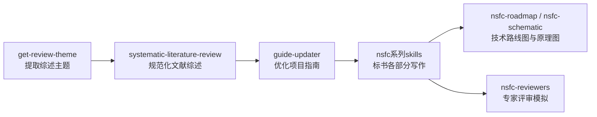

# AI 技能使用指南

本项目内置多个 AI 技能（Skills），辅助 LaTeX 写作和模板优化。**兼容 Claude Code 和 OpenAI Codex CLI！**

> 📋 **Skills 开发规范**：本项目遵循通用的 Skills 开发规范，详见 [huangwb8/skills](https://github.com/huangwb8/skills)

## 推荐工作流

以下为开发者推荐的完整文献调研与标书写作工作流：



### 工作流步骤

**第一步：提取综述主题**
- 使用 `get-review-theme` 从任意输入源提取结构化综述主题
- 获得主题、关键词、核心问题的清晰定义

**第二步：规范化文献综述**
- 使用 `systematic-literature-review` 进行全面、深入的文献调研
- 支持多源检索与自动降级（MCP → OpenAlex → Semantic Scholar → Crossref）
- 生成专家级综述文档（支持 Premium/Standard/Basic 三档）
- 摘要补齐默认启用，提升文献评估准确性
- 检索质量评估与可视化，自动生成优化建议
- 导出 PDF 与 Word 双格式

**第三步：优化项目指南** ⭐ 重要
- 使用 `guide-updater` 基于综述结果优化项目指南
- 在这一步深入理解：
  - 为什么要做这个研究？
  - 研究的亮点在哪里？
  - 现有研究的局限与不足
  - 本研究的切入点与贡献
- 为后续标书写作提供清晰的方向指引

**第四步：标书各部分写作**
- 使用 nsfc 系列技能，基于优化后的项目指南进行标书写作：
  - `nsfc-justification-writer`：立项依据
  - `nsfc-research-content-writer`：研究内容
  - `nsfc-research-foundation-writer`：研究基础
  - 其他 nsfc 系列技能

### 工作流优势

- **系统性**：从主题提取到文献综述，再到指南优化和标书写作，形成完整闭环
- **渐进式深入**：每一步都为下一步提供坚实基础
- **聚焦关键问题**：通过 guide-updater 阶段深入思考研究本质
- **质量保障**：每个环节都有专业技能支撑，确保输出质量

---

## 当前技能列表

### 1. make_latex_model - 样式对齐优化

**类型**：🔧 开发

**功能**：基于最新 PDF/Word 模板，高保真优化 LaTeX 样式（推荐 PDF 单源）

**使用场景**：NSFC 发布新模板（PDF 或 Word），需要 LaTeX 模板与之像素级对齐

**推荐 Prompt 模板**：

```
请使用 make_latex_model 这个 skill 对 projects/NSFC_Young 进行改造，使其与 template/2026年最新word模板-青年科学基金项目（C类）-正文.pdf 对齐
```

**技能特点**：
- 仅修改 `projects/{project}/extraTex/@config.tex`
- 修改 `main.tex` 中的标题文本（不触碰正文内容）
- 支持标题文字对齐和样式参数对齐

[详细文档 →](make_latex_model/SKILL.md)

---

### 2. complete_example - 智能示例生成

**类型**：🔧 开发

**功能**：快速生成示例内容，填充空白章节

**使用场景**：需要快速生成演示内容或测试排版效果

**推荐 Prompt 模板**：

```
请你联网调研一下某研究主题，假设你要以此为题材填写 projects/NSFC_Young，请使用 complete_example 这个 skill 辅助工作。最后的排版，PDF 要紧凑、美观，大致维持在 8 页左右。
```

[详细文档 →](complete_example/SKILL.md)

---

### 3. transfer_old_latex_to_new - 标书智能迁移

**类型**：📝 日常

**功能**：将旧标书内容迁移到新模板

**使用场景**：旧版本标书迁移到新模板（结构变化大的情况）

**推荐 Prompt 模板**：

```
请基于 transfer_old_latex_to_new 这个 skill 把 /xxx/NSFC_Young_2025 这个旧项目迁移到 /xxx/NSFC_Young_2026 这个文件夹里；新项目的模板是 projects/NSFC_Young。注意，千万不能修改或者删除 NSFC_Young_2025 里面的任何文件（完全只读）；只需要在 NSFC_Young_2026 里按要求生成内容就行。如果你工作时有测试文件/中间文件要生成，请一律放在 ./tests/v202601081624 里；测试/中间文件必须要保存在该测试目录里。
```

**技能特点**：
- 充当顶尖科学家的角色
- AI 自主规划迁移策略
- 严格遵守新模板格式

[详细文档 →](transfer_old_latex_to_new/SKILL.md)

---

### 4. nsfc-abstract - 中英文摘要生成

**状态**：🚧 开发中（版本见 `skills/nsfc-abstract/config.yaml`）

**类型**：📝 日常

**功能**：根据用户提供的信息表生成中文摘要（≤400字，含标点）与对应英文摘要（≤4000字符，含标点；英文为中文的忠实翻译，不新增信息），并输出长度自检。

**使用场景**：需要快速写出符合评审阅读习惯的“五句式”摘要，并确保中英文长度约束合规。

**推荐 Prompt 模板**：

```
请使用 nsfc-abstract：
信息表：请按 skills/nsfc-abstract/references/info_form.md 提供
输出：中文摘要（≤400字，含标点）+ 对应英文摘要（≤4000字符，含标点；英文为中文的忠实翻译，不新增信息）
输出方式：写入工作目录下的 NSFC-ABSTRACTS.md（中文一个 # 标题、英文一个 # 标题），并在文件末尾给出字符数自检
```

**可选校验**：`python3 skills/nsfc-abstract/scripts/validate_abstract.py NSFC-ABSTRACTS.md --strict`

[详细文档 →](nsfc-abstract/SKILL.md)

---

### 5. nsfc-justification-writer - 理论创新导向的立项依据写作

**状态**：✅ 稳定（v0.7.8）

**类型**：📝 日常

**功能**：面向各类科研基金申请书"立项依据"章节的写作/重构（**理论创新导向**，防止用方法学术语稀释科学问题主线），适用于 NSFC 及其他科研基金申请场景

**使用场景**：需要把"价值与必要性、现状不足、科学问题/科学假设、切入点与贡献"写成可直接落到 `extraTex/1.1.立项依据.tex` 的正文

**新增（v0.2.0）**：
- 结构/引用/字数/危险命令的硬编码诊断
- 术语一致性矩阵（alias_groups）
- 安全写入脚本（定位 `\subsubsection` 并替换正文 + 备份）

**推荐 Prompt 模板**：

```
请使用 nsfc-justification-writer：
目标项目：projects/NSFC_Young
信息表：请按 skills/nsfc-justification-writer/references/info_form.md 提供
输出：写入 extraTex/1.1.立项依据.tex（不要改 main.tex）
```

[详细文档 →](nsfc-justification-writer/SKILL.md)

---

### 6. nsfc-research-content-writer - 研究内容编排写作

**状态**：🚧 开发中

**类型**：📝 日常

**功能**：面向 NSFC 标书正文 `（二）研究内容` 写作/重构，并同步编排 `特色与创新` 与 `年度研究计划`

**使用场景**：需要把“研究问题→目标→内容→技术路线→验证口径”写清，并输出 `2.1/2.2/2.3` 三份一致闭环的文件

**推荐 Prompt 模板**：

```
请使用 nsfc-research-content-writer：
目标项目：projects/NSFC_Young
信息表：请按 skills/nsfc-research-content-writer/references/info_form.md 提供
输出模式：preview（先预览）/ apply（确认后写入）
输出：写入 extraTex/2.1.研究内容.tex、extraTex/2.2.特色与创新.tex、extraTex/2.3.年度研究计划.tex（不要改 main.tex、extraTex/@config.tex）
额外要求：子目标编号 S1–S4；2.2/2.3 标注回溯到对应 Sx；每年都有里程碑与可交付物
```

[详细文档 →](nsfc-research-content-writer/SKILL.md)

---

### 7. nsfc-research-foundation-writer - 研究基础编排写作

**状态**：🚧 开发中

**类型**：📝 日常

**功能**：面向 NSFC 标书正文 `（三）研究基础` 写作/重构，并同步编排 `工作条件` 与 `风险应对`

**使用场景**：需要用“证据链 + 条件对位 + 风险预案”证明可行性，并输出 `3.1/3.2` 两份对齐研究内容的文件

**推荐 Prompt 模板**：

```
请使用 nsfc-research-foundation-writer：
目标项目：projects/NSFC_Young
信息表：请按 skills/nsfc-research-foundation-writer/references/info_form.md 提供
output_mode：preview（先预览）/ apply（确认后写入）
输出：写入 extraTex/3.1.研究基础.tex、extraTex/3.2.工作条件.tex（不要改 main.tex、extraTex/@config.tex、任何 .cls/.sty）
```

[详细文档 →](nsfc-research-foundation-writer/SKILL.md)

---

### 8. systematic-literature-review - 系统综述生成

**状态**：✅ 稳定（v1.0.9）

**类型**：📝 日常

**功能**：令人印象深刻的精准、全面的专家级综述

**使用场景**：
- 系统综述/文献综述/Related Work/文献调研
- 学位论文 Related Work 章节
- 期刊综述投稿（顶刊/普通）
- NSFC 标书立项依据部分

**推荐 Prompt 模板**：

```
请用 systematic-literature-review 写一篇"HER2-ADC在乳腺癌中的研究进展"的Premium级综述。参考文献以近2023-2025年为主，更早之前的文献，如果特别相关、特别重要的，也可以纳入。要有一个小节，专门讨论出未来3年较有前景的研究方向。工作目录名为 HER2-ADC-01。
```

**技能特点**：
- **AI 自定检索词**：根据主题特性自主规划查询变体（通常 5-15 组）
- **多源检索与自动降级**：MCP → OpenAlex → Semantic Scholar → Crossref → DuckDuckGo
- **AI 语义评分**：逐篇阅读标题摘要，1–10 分相关性评分 + 子主题自动分组
- **高分优先选文**：按高分优先比例（60–80%）和目标数量选文（默认不“打满 max_refs”）
- **摘要补齐默认启用**：默认在选文后对 `selected_papers` 做多源补齐，降低检索阶段耗时与 cache 膨胀
- **API 缓存（默认开启）**：默认 `mode=minimal`（不缓存 OpenAlex 原始分页响应）；需要更强可复现性时再切 `mode=full`
- **检索质量评估**：查询效果可视化，自动生成优化建议
- **字数预算生成**：自动生成"综/述"字数预算（70% 引用段 + 30% 无引用段）
- **三档位支持**：Premium（旗舰级）、Standard（标准级）、Basic（基础级）
- **多语言支持**：支持 en/zh/ja/de/fr/es 翻译与智能编译
- **表格样式更稳健**：长表格列宽基于 `\textwidth` 按比例分配，避免固定 `p{}` 宽度溢出
- **导出链路加固**：template override 同级目录可参与 TEXINPUTS/BSTINPUTS；清理规则更安全
- **强制导出**：PDF 与 Word 双格式

**档位对照表**：

| 档位 | 字数范围 | 参考文献数 | PDF 页数 | 典型场景 |
|------|---------|-----------|---------|----------|
| **Premium（旗舰级）** | 10000–15000 | 80–150 | 16–25 页 | Nature Reviews 级别综述 |
| **Standard（标准级）** | 6000–10000 | 50–90 | 10–16 页 | 学位论文 Related Work、普通期刊综述 |
| **Basic（基础级）** | 3000–6000 | 30–60 | 5–10 页 | 快速调研、课程作业 |

> 💡 **示例**：查看 [examples/](systematic-literature-review/examples/) 目录，包含本 skill 实际生成的专家级综述示例。

[详细文档 →](systematic-literature-review/README.md)

---

### 9. nsfc-reviewers - NSFC 标书专家评审模拟

**状态**：🚧 开发中（v0.5.0）

**类型**：📝 日常

**功能**：模拟领域专家视角对 NSFC 标书进行多维度评审，输出分级问题（P0/P1/P2）与可执行修改建议

**使用场景**：
- 标书写作完成后的自我评审
- 提交前的质量检查
- 识别标书中的致命缺陷（P0）、重要问题（P1）和建议改进（P2）

**推荐 Prompt 模板**：

```
请使用 nsfc-reviewers 评审以下标书：
目标项目：projects/NSFC_Young
评审组数：2（默认，最多 5 组）
```

**技能特点**：
- 5 位专家角色：创新性、可行性、基础与团队、严格综合、建设性
- 并行多组评审（依赖 parallel-vibe），支持 1-5 组独立专家组
- 跨组共识聚合（默认 60% 共识阈值），自动升级严重度
- 6 维度评审：创新性 25%、假说 20%、方法 20%、基础 15%、团队 10%、成果 10%
- 无 parallel-vibe 时自动降级到单组模式

[详细文档 →](nsfc-reviewers/SKILL.md)

---

### 10. nsfc-roadmap - NSFC 技术路线图生成

**状态**：🚧 开发中（v0.8.0）

**类型**：📝 日常

**功能**：从 NSFC 标书自动生成可打印、A4 可读的技术路线图

**使用场景**：
- 需要将研究内容转成技术路线图
- 需要可编辑的 `.drawio` 源文件和可嵌入文档的渲染结果

**推荐 Prompt 模板**：

```
请使用 nsfc-roadmap 生成技术路线图：
目标项目：projects/NSFC_Young
参考模板：model-02（可选，从 references/models/ 中选择）
```

**技能特点**：
- 输出 `.drawio`（可编辑）与 `.svg`/`.png`/`.pdf`（交付）
- 内置 6 个参考模板（model-01 ~ model-06）
- 多轮评估-优化（默认 5 轮），三维度自检（结构/视觉/可读性）
- "平台期停止"策略：基于 PNG 哈希与分数提升阈值自动停止
- 支持规划模式：先审阅 `roadmap-plan.md` 再生成

[详细文档 →](nsfc-roadmap/SKILL.md)

---

### 11. nsfc-schematic - NSFC 原理图/机制图生成

**状态**：🚧 开发中（v0.8.1）

**类型**：📝 日常

**功能**：将标书中的机制描述、算法结构、模块关系转成原理图/机制图

**使用场景**：
- 需要将研究机制、算法架构转成可视化图示
- 需要可编辑的 `.drawio` 源文件和可嵌入文档的渲染结果

**推荐 Prompt 模板**：

```
请使用 nsfc-schematic 生成原理图：
目标项目：projects/NSFC_Young
输入：extraTex/2.1.研究内容.tex（或自然语言描述）
```

**技能特点**：
- 分组结构：输入层 → 处理层 → 输出层（柔性）+ 任意连线
- 节点文案自动扩容，避免文字溢出/遮挡
- 正交路由，避免连线穿字
- 多轮评估-优化（默认 5 轮），三维度自检（结构/视觉/可读性）
- 元素层级保护：分组底层 → 连线中层 → 节点顶层
- 图类型模板库（5 类常用骨架）+ 规划阶段自动选型
- 支持规划模式：先审阅 `schematic-plan.md` 再生成

[详细文档 →](nsfc-schematic/SKILL.md)

---

### 12. check-review-alignment - 综述引用语义一致性检查

**状态**：✅ 稳定（v1.0.2）

**类型**：📝 日常

**功能**：通过宿主 AI 的语义理解逐条核查引用是否与文献内容吻合，只在发现致命性引用错误时对"包含引用的句子"做最小化改写

**使用场景**：
- 用户要求"核查/优化综述 `{主题}_review.tex` 的正文引用"
- 检查引用的文献是否真实存在（.bib 中缺失或 bibkey 错误）
- 检查引用命令中的 bibkey 与文意是否相符（张冠李戴）
- 检查正文描述与论文内容是否矛盾

**推荐 Prompt 模板**：

```
请使用 check-review-alignment 核查以下综述文档的引用语义一致性：
[综述文档路径：.tex/.md/.docx]
```

**技能特点**：
- **不为了改而改**：无法确定是否为致命性错误时，保留原样并在报告中警告
- **错误优先级分级**：
  - P0（must_fix）：致命性错误，必须修复（虚假引用、错误引用、矛盾引用）
  - P1（warn_only）：仅警告，不改写（支持度弱、过度宣称）
  - P2（skip）：禁止修改（文体/表达优化）
- **多格式支持**：LaTeX、Markdown、Word
- **渲染复用**：完美复用 systematic-literature-review 的 PDF/Word 渲染流程

**核心原则**：
- 只修复致命性引用错误（虚假/错误/矛盾引用）
- 不做文体优化（P2 级别）或过度调整（P1 级别）
- 在不确定时保留原样，并在报告中警告

[详细文档 →](check-review-alignment/SKILL.md)

---

### 13. get-review-theme - 综述主题提取

**状态**：🚧 开发中

**类型**：📝 日常

**功能**：从任意输入源提取结构化综述主题

**使用场景**：
- 从文件（PDF/Word/Markdown/Tex）、文件夹、图片、自然语言描述、网页 URL 提取主题
- 生成"主题+关键词+核心问题"结构化输出
- 作为 systematic-literature-review 的前置步骤

**推荐 Prompt 模板**：

```
请使用 get-review-theme 从以下来源提取综述主题：
[输入源：文件路径/URL/自然语言描述等]
```

**技能特点**：
- 支持多模态输入（文本、图片、URL）
- 自动识别输入类型并提取内容
- 生成可直接用于 systematic-literature-review 的结构化输出

---

### 14. guide-updater - 项目指南优化

**状态**：✅ 稳定（v1.0.0）

**类型**：📝 日常

**功能**：基于文献综述结果优化项目指南文档

**使用场景**：
- 文献综述完成后，梳理研究发现
- 明确"为什么要做这个研究"、"研究的亮点在哪里"等关键问题
- 为 NSFC 标书写作提供清晰的研究方向指引

**推荐 Prompt 模板**：

```
请使用 guide-updater 基于以下文献综述结果优化项目指南：
[综述结果文件/目录]
```

**技能特点**：
- 梳理文献综述的核心发现
- 提炼研究切入点和创新性
- 生成结构化的项目指南文档

---

## 技能依赖关系

某些技能依赖其他技能的输出，形成完整的工作流：

### 工作流中的技能协作

- **get-review-theme**：前置步骤，提取主题关键词
- **systematic-literature-review**：核心文献综述（可选依赖 get-review-theme 的输出）
- **guide-updater**：中间优化，基于综述结果沉淀写作规范（依赖 systematic-literature-review 的输出）
- **nsfc系列写作skills**：最终撰写标书各模块（可选依赖 guide-updater 优化的指南）
- **nsfc-roadmap / nsfc-schematic**：基于写作内容生成技术路线图与原理图
- **nsfc-reviewers**：标书完成后模拟专家评审（依赖标书完整正文）

### 推荐使用顺序

对于 NSFC 标书写作，建议按以下顺序使用技能：

1. **get-review-theme** → 提取综述主题
2. **systematic-literature-review** → 生成文献综述
3. **guide-updater** → 优化项目指南（⭐ 重要环节）
4. **nsfc-justification-writer** → 撰写立项依据
5. **nsfc-research-content-writer** → 撰写研究内容
6. **nsfc-research-foundation-writer** → 撰写研究基础
7. **nsfc-roadmap** / **nsfc-schematic** → 生成技术路线图与原理图
8. **nsfc-reviewers** → 模拟专家评审，发现问题并迭代优化

---

## 调用方式

| 工具 | 调用方式 | 示例 |
|------|----------|------|
| **Claude Code** | 自然语言描述 | "请将 NSFC_Young 对齐到 2026 Word 样式" |
| **OpenAI Codex CLI** | `/skill-name` 参数 | `/complete_example NSFC_Young --content-density moderate` |

## 技能类型说明

| 类型 | 说明 | 面向对象 |
|------|------|----------|
| 🔧 开发 | 模板调试、样式对齐、示例生成 | 开发者 |
| 📝 日常 | 文献调研、标书写作、内容迁移 | 普通用户 |
