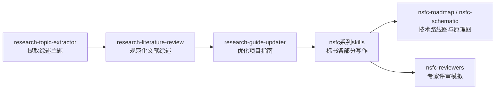

# AI 技能使用指南

本项目内置多个 AI 技能（Skills），辅助 LaTeX 写作和模板优化。**兼容 Claude Code 和 OpenAI Codex CLI！**

> 📋 **Skills 开发规范**：本项目遵循通用的 Skills 开发规范，详见 [huangwb8/skills](https://github.com/huangwb8/skills)

## 推荐工作流

以下为开发者推荐的完整文献调研与标书写作工作流：


```mermaid
graph LR
    A[research-topic-extractor<br>提取综述主题] --> B[research-literature-review<br>规范化文献综述]
    B --> C[research-guide-updater<br>优化项目指南]
    C --> D[nsfc系列skills<br>标书各部分写作]
    D --> E[nsfc-roadmap / nsfc-schematic<br>技术路线图与原理图]
    D --> F[nsfc-reviewers<br>专家评审模拟]
```

### 工作流步骤

**第一步：提取综述主题**
- 使用 `research-topic-extractor` 从任意输入源提取结构化综述主题
- 获得主题、关键词、核心问题的清晰定义

**第二步：规范化文献综述**
- 使用 `research-literature-review` 进行全面、深入的文献调研
- 支持多源检索与自动降级（MCP → OpenAlex → Semantic Scholar → Crossref）
- 生成专家级综述文档（支持 Premium/Standard/Basic 三档）
- 摘要补齐默认启用，提升文献评估准确性
- 检索质量评估与可视化，自动生成优化建议
- 导出 PDF 与 Word 双格式

**第三步：优化项目指南** ⭐ 重要
- 使用 `research-guide-updater` 基于综述结果优化项目指南
- 在这一步深入理解：
  - 为什么要做这个研究？
  - 研究的亮点在哪里？
  - 现有研究的局限与不足
  - 本研究的切入点与贡献
- 为后续标书写作提供清晰的方向指引

**第四步：标书各部分写作**
- 使用 nsfc 系列技能，基于优化后的项目指南进行标书写作：
  - `nsfc-justification-writer`：立项依据
  - `nsfc-research-content-writer`：研究内容
  - `nsfc-research-foundation-writer`：研究基础
  - 其他 nsfc 系列技能

### 工作流优势

- **系统性**：从主题提取到文献综述，再到指南优化和标书写作，形成完整闭环
- **渐进式深入**：每一步都为下一步提供坚实基础
- **聚焦关键问题**：通过 research-guide-updater 阶段深入思考研究本质
- **质量保障**：每个环节都有专业技能支撑，确保输出质量

---

## 当前技能列表

说明：
- 新任务、新文档和新脚本请统一使用当前名称；旧名称只作为存量 Prompt 的兼容入口
- `make-latex-model` 取代旧写法 `make_latex_model`
- `transfer-old-latex-to-new` 取代历史别名 `migrating-latex-templates`
- 研究类 skills 已统一迁移为 `research-*` 系列，命名更贴近职责边界
- 版本号以各 `skills/*/config.yaml` 为单一真相来源；本页仅保留关键能力、适用场景与推荐 Prompt

研究类 skill 迁移表：

| 历史名称 | 当前名称 | 现在怎么用 |
| --- | --- | --- |
| `get-review-theme` | `research-topic-extractor` | 用新名提取综述主题；旧名仅兼容存量 Prompt |
| `guide-updater` | `research-guide-updater` | 用新名沉淀项目指南；旧名仅兼容存量 Prompt |
| `check-review-alignment` | `research-citation-check` | 用新名检查综述引用语义；旧名仅兼容存量 Prompt |
| `make-research-plan` | `research-plan` | 用新名制定科研分析策略；旧名仅兼容存量 Prompt |
| `systematic-literature-review` | `research-literature-review` | 用新名生成系统综述；旧名仅兼容存量 Prompt |

### 1. make-latex-model - 样式对齐优化

**类型**：🔧 开发

**功能**：面向整个 ChineseResearchLaTeX 的模板落地与高保真对齐，支持 `NSFC / paper / thesis / cv` 四条产品线

**使用场景**：需要把 `projects/*` 做成高质量模板，或根据 PDF / Word / baseline 对齐现有模板，同时正确判断应改项目层还是公共包层

**推荐 Prompt 模板**：

```
请使用 make-latex-model 这个 skill 处理 projects/thesis-nju-master。
参考基线：学校 PDF 或现有 baseline。
目标：根据当前 ChineseResearchLaTeX 的真实分层，把问题改到正确层级；如果属于共享样式，请优先修改 packages/bensz-thesis。
```

**技能特点**：
- 先判断 `projects/*` 还是 `packages/bensz-*` 才是正确修改层
- 如果必须改公共包，会先生成回归矩阵并要求回归该包覆盖的现有模板
- 默认走各产品线官方构建入口验收
- 对 `validate.sh`、`optimize.py`、`core/template_catalog.py` 等脚本按 NSFC 专项工具处理，不把整个 skill 叙述成它们的延伸
- 触发时优先使用 `make-latex-model`，也兼容旧写法 `make_latex_model`

[详细文档 →](make-latex-model/SKILL.md)

---

### 2. complete-example - 智能示例生成

**类型**：🔧 开发

**功能**：快速生成示例内容，填充空白章节

**使用场景**：需要快速生成演示内容或测试排版效果

**推荐 Prompt 模板**：

```
请你联网调研一下某研究主题，假设你要以此为题材填写 projects/NSFC_Young，请使用 complete-example 这个 skill 辅助工作。最后的排版，PDF 要紧凑、美观，大致维持在 8 页左右。
```

[详细文档 →](complete-example/SKILL.md)

---

### 3. transfer-old-latex-to-new - 模板迁移与重构编排

**类型**：📝 日常

**功能**：把旧项目、旧模板或多源材料迁移/整理到当前 ChineseResearchLaTeX 的合适结构中

**使用场景**：旧标书/旧论文/旧毕业论文/旧简历/零散 Word-PDF-tex 材料接入当前仓库的 NSFC、paper、thesis、cv 产品线

**推荐 Prompt 模板**：

```
请使用 transfer-old-latex-to-new 这个 skill，把我现有的旧材料迁移/整理/重构到 ChineseResearchLaTeX 当前合适的模板里。
输入：可以是项目目录、tex/docx/pdf/md、截图、说明文字的任意组合
目标：请你自己判断应该修改 packages 还是 projects，最后做出一个结构清晰、可维护、尽量可构建的结果；输出形式也由你自主决定。
```

**技能特点**：
- AI 自主托管输入解析与输出形态
- 适配当前 `projects/` 的 NSFC / paper / thesis / cv 四条产品线
- `run.py` 等脚本仅作为 legacy CLI 后备，不再限制主工作流
- 触发时优先使用 `transfer-old-latex-to-new`，也兼容历史别名 `migrating-latex-templates`

[详细文档 →](transfer-old-latex-to-new/SKILL.md)

---

### 4. nsfc-abstract - 中英文摘要生成

**状态**：🚧 开发中（版本见 `skills/nsfc-abstract/config.yaml`）

**类型**：📝 日常

**功能**：根据用户提供的信息表生成中文摘要（≤400字，含标点）与对应英文摘要（≤4000字符，含标点；英文为中文的忠实翻译，不新增信息），并输出长度自检。

**使用场景**：需要快速写出符合评审阅读习惯的“五句式”摘要，并确保中英文长度约束合规。

**推荐 Prompt 模板**：

```
请使用 nsfc-abstract：
信息表：请按 skills/nsfc-abstract/references/info_form.md 提供
输出：中文摘要（≤400字，含标点）+ 对应英文摘要（≤4000字符，含标点；英文为中文的忠实翻译，不新增信息）
输出方式：写入工作目录下的 NSFC-ABSTRACTS.md（中文一个 # 标题、英文一个 # 标题），并在文件末尾给出字符数自检
```

**可选校验**：`python3 skills/nsfc-abstract/scripts/validate_abstract.py NSFC-ABSTRACTS.md --strict`

[详细文档 →](nsfc-abstract/SKILL.md)

---

### 5. nsfc-justification-writer - 理论创新导向的立项依据写作

**状态**：✅ 稳定（v0.7.9）

**类型**：📝 日常

**功能**：面向各类科研基金申请书"立项依据"章节的写作/重构（**理论创新导向**，防止用方法学术语稀释科学问题主线），适用于 NSFC 及其他科研基金申请场景

**使用场景**：需要把"价值与必要性、现状不足、科学问题/科学假设、切入点与贡献"写成可直接落到 `extraTex/1.1.立项依据.tex` 的正文

**新增（v0.2.0）**：
- 结构/引用/字数/危险命令的硬编码诊断
- 术语一致性矩阵（alias_groups）
- 安全写入脚本（定位 `\subsubsection` 并替换正文 + 备份）

**推荐 Prompt 模板**：

```
请使用 nsfc-justification-writer：
目标项目：projects/NSFC_Young
信息表：请按 skills/nsfc-justification-writer/references/info_form.md 提供
输出：写入 extraTex/1.1.立项依据.tex（不要改 main.tex）
```

[详细文档 →](nsfc-justification-writer/SKILL.md)

---

### 6. nsfc-research-content-writer - 研究内容编排写作

**状态**：🚧 开发中

**类型**：📝 日常

**功能**：面向 NSFC 标书正文 `（二）研究内容` 写作/重构，并同步编排 `特色与创新` 与 `年度研究计划`

**使用场景**：需要把“研究问题→目标→内容→技术路线→验证口径”写清，并输出 `2.1/2.2/2.3` 三份一致闭环的文件

**推荐 Prompt 模板**：

```
请使用 nsfc-research-content-writer：
目标项目：projects/NSFC_Young
信息表：请按 skills/nsfc-research-content-writer/references/info_form.md 提供
输出模式：preview（先预览）/ apply（确认后写入）
输出：写入 extraTex/2.1.研究内容.tex、extraTex/2.2.特色与创新.tex、extraTex/2.3.年度研究计划.tex（不要改 main.tex、extraTex/@config.tex）
额外要求：子目标编号 S1–S4；2.2/2.3 标注回溯到对应 Sx；每年都有里程碑与可交付物
```

[详细文档 →](nsfc-research-content-writer/SKILL.md)

---

### 7. nsfc-research-foundation-writer - 研究基础编排写作

**状态**：🚧 开发中

**类型**：📝 日常

**功能**：面向 NSFC 标书正文 `（三）研究基础` 写作/重构，并同步编排 `工作条件` 与 `风险应对`

**使用场景**：需要用“证据链 + 条件对位 + 风险预案”证明可行性，并输出 `3.1/3.2` 两份对齐研究内容的文件

**推荐 Prompt 模板**：

```
请使用 nsfc-research-foundation-writer：
目标项目：projects/NSFC_Young
信息表：请按 skills/nsfc-research-foundation-writer/references/info_form.md 提供
output_mode：preview（先预览）/ apply（确认后写入）
输出：写入 extraTex/3.1.研究基础.tex、extraTex/3.2.工作条件.tex（不要改 main.tex、extraTex/@config.tex、任何 .cls/.sty）
```

[详细文档 →](nsfc-research-foundation-writer/SKILL.md)

---

### 8. research-literature-review - 系统综述生成

**状态**：✅ 稳定（v1.1.0）

**类型**：📝 日常

**功能**：令人印象深刻的精准、全面的专家级综述

**使用场景**：
- 系统综述/文献综述/Related Work/文献调研
- 学位论文 Related Work 章节
- 期刊综述投稿（顶刊/普通）
- NSFC 标书立项依据部分

**推荐 Prompt 模板**：

```
请用 research-literature-review 写一篇"HER2-ADC在乳腺癌中的研究进展"的Premium级综述。参考文献以近2023-2025年为主，更早之前的文献，如果特别相关、特别重要的，也可以纳入。要有一个小节，专门讨论出未来3年较有前景的研究方向。工作目录名为 HER2-ADC-01。
```

**技能特点**：
- **AI 自定检索词**：根据主题特性自主规划查询变体（通常 5-15 组）
- **多源检索与自动降级**：MCP → OpenAlex → Semantic Scholar → Crossref → DuckDuckGo
- **AI 语义评分**：逐篇阅读标题摘要，1–10 分相关性评分 + 子主题自动分组
- **高分优先选文**：按高分优先比例（60–80%）和目标数量选文（默认不“打满 max_refs”）
- **摘要补齐默认启用**：默认在选文后对 `selected_papers` 做多源补齐，降低检索阶段耗时与 cache 膨胀
- **API 缓存（默认开启）**：默认 `mode=minimal`（不缓存 OpenAlex 原始分页响应）；需要更强可复现性时再切 `mode=full`
- **检索质量评估**：查询效果可视化，自动生成优化建议
- **字数预算生成**：自动生成"综/述"字数预算（70% 引用段 + 30% 无引用段）
- **三档位支持**：Premium（旗舰级）、Standard（标准级）、Basic（基础级）
- **多语言支持**：支持 en/zh/ja/de/fr/es 翻译与智能编译
- **表格样式更稳健**：长表格列宽基于 `\textwidth` 按比例分配，避免固定 `p{}` 宽度溢出
- **导出链路加固**：template override 同级目录可参与 TEXINPUTS/BSTINPUTS；清理规则更安全
- **强制导出**：PDF 与 Word 双格式

**档位对照表**：

| 档位 | 字数范围 | 参考文献数 | PDF 页数 | 典型场景 |
|------|---------|-----------|---------|----------|
| **Premium（旗舰级）** | 10000–15000 | 80–150 | 16–25 页 | Nature Reviews 级别综述 |
| **Standard（标准级）** | 6000–10000 | 50–90 | 10–16 页 | 学位论文 Related Work、普通期刊综述 |
| **Basic（基础级）** | 3000–6000 | 30–60 | 5–10 页 | 快速调研、课程作业 |

> 💡 **示例**：查看 [examples/](research-literature-review/examples/) 目录，包含本 skill 实际生成的专家级综述示例。

[详细文档 →](research-literature-review/README.md)

---

### 9. nsfc-reviewers - NSFC 标书专家评审模拟

**状态**：✅ 稳定（v1.4.0）

**类型**：📝 日常

**功能**：模拟领域专家视角对 NSFC 标书进行多维度评审，输出分级问题（P0/P1/P2）与可执行修改建议，并默认给出“基于当前版本直接送审”的函评/会评 `给过 / 不给过` 判断；每组固定 7 位专家，且能识别“受资助额度限制的设计妥协”

**使用场景**：
- 标书写作完成后的自我评审
- 提交前的质量检查
- 识别标书中的致命缺陷（P0）、重要问题（P1）和建议改进（P2）

**推荐 Prompt 模板**：

```
请使用 nsfc-reviewers 评审以下标书：
目标项目：projects/NSFC_Young
评审组数：3（默认，最多 5 组）
```

**技能特点**：
- 7 位专家角色：创新性、可行性、基础与团队、严格综合、建设性、科学意义、清晰度
- 并行多组评审（依赖 parallel-vibe），支持 1-5 组独立专家组，默认 3 组
- 跨组共识聚合（默认 60% 共识阈值），自动升级严重度
- 默认输出函评/会评二元判断，并给出把握度、主要依据与翻盘关键
- 对资助受限导致的方案偏弱会单独归因，并补充“若资助不受限时的完整设计参考”
- 6 维度评审：创新性 25%、假说 20%、方法 20%、基础 15%、团队 10%、成果 10%
- 无 parallel-vibe 时自动降级到单组模式

[详细文档 →](nsfc-reviewers/SKILL.md)

---

### 10. nsfc-roadmap - NSFC 技术路线图生成

**状态**：🚧 开发中（v0.9.1）

**类型**：📝 日常

**功能**：从 NSFC 标书自动生成可打印、A4 可读的技术路线图

**使用场景**：
- 需要将研究内容转成技术路线图
- 需要可编辑的 `.drawio` 源文件和可嵌入文档的渲染结果

**推荐 Prompt 模板**：

```
请使用 nsfc-roadmap 生成技术路线图：
目标项目：projects/NSFC_Young
```

**技能特点**：
- 输出 `.drawio`（可编辑）与 `.svg`/`.png`/`.pdf`（交付）
- 内置参考图（model-01 ~ model-10）；规划阶段自动生成“模型画廊”（contact sheet）用于学习优秀结构与信息密度控制（默认不建议固定到单一模板）
- 多轮评估-优化（默认 5 轮），三维度自检（结构/视觉/可读性）
- "平台期停止"策略：基于 PNG 哈希与分数提升阈值自动停止
- 支持规划模式：纯 AI 规划（默认），先审阅 `roadmap-plan.md` 再生成
- Nano Banana PNG-only 模式兼容 Gemini 与 OpenAI `gpt-image-2`

[详细文档 →](nsfc-roadmap/SKILL.md)

---

### 11. nsfc-schematic - NSFC 原理图/机制图生成

**状态**：🚧 开发中（v0.10.0）

**类型**：📝 日常

**功能**：将标书中的机制描述、算法结构、模块关系转成原理图/机制图

**使用场景**：
- 需要将研究机制、算法架构转成可视化图示
- 需要可编辑的 `.drawio` 源文件和可嵌入文档的渲染结果

**推荐 Prompt 模板**：

```
请使用 nsfc-schematic 生成原理图：
目标项目：projects/NSFC_Young
输入：extraTex/2.1.研究内容.tex（或自然语言描述）
```

**技能特点**：
- 分组结构：输入层 → 处理层 → 输出层（柔性）+ 任意连线
- 节点文案自动扩容，避免文字溢出/遮挡
- 正交路由 + 标签避障锚点，降低连线/标签压字
- 多轮评估-优化（默认 5 轮），三维度自检（结构/视觉/可读性）
- 元素层级保护：分组底层 → 连线中层 → 节点顶层
- 默认关闭图内标题，避免标题与分组冲突；支持按需开启
- 图类型参考图（5 类常用骨架 + 多个 `model-xx` 视觉参考）+ “模型画廊”（skeleton/simple 优先）用于学习结构与风格（默认纯 AI 规划，不要求模板单选）
- 支持规划模式：先审阅 `schematic-plan.md` 再生成
- Nano Banana PNG-only 模式兼容 Gemini 与 OpenAI `gpt-image-2`

[详细文档 →](nsfc-schematic/SKILL.md)

---

### 12. research-citation-check - 综述引用语义一致性检查

**状态**：✅ 稳定（v1.1.0）

**类型**：📝 日常

**功能**：通过宿主 AI 的语义理解逐条核查引用是否与文献内容吻合，只在发现致命性引用错误时对"包含引用的句子"做最小化改写

**使用场景**：
- 用户要求"核查/优化综述 `{主题}_review.tex` 的正文引用"
- 检查引用的文献是否真实存在（.bib 中缺失或 bibkey 错误）
- 检查引用命令中的 bibkey 与文意是否相符（张冠李戴）
- 检查正文描述与论文内容是否矛盾

**推荐 Prompt 模板**：

```
请使用 research-citation-check 核查以下综述文档的引用语义一致性：
[综述文档路径：.tex/.md/.docx]
```

**技能特点**：
- **不为了改而改**：无法确定是否为致命性错误时，保留原样并在报告中警告
- **错误优先级分级**：
  - P0（must_fix）：致命性错误，必须修复（虚假引用、错误引用、矛盾引用）
  - P1（warn_only）：仅警告，不改写（支持度弱、过度宣称）
  - P2（skip）：禁止修改（文体/表达优化）
- **多格式支持**：LaTeX、Markdown、Word
- **渲染复用**：完美复用 research-literature-review 的 PDF/Word 渲染流程

**核心原则**：
- 只修复致命性引用错误（虚假/错误/矛盾引用）
- 不做文体优化（P2 级别）或过度调整（P1 级别）
- 在不确定时保留原样，并在报告中警告

[详细文档 →](research-citation-check/SKILL.md)

---

### 13. research-topic-extractor - 综述主题提取

**状态**：✅ 稳定（v1.1.0）

**类型**：📝 日常

**功能**：从任意输入源提取结构化综述主题

**使用场景**：
- 从文件（PDF/Word/Markdown/Tex）、文件夹、图片、自然语言描述、网页 URL 提取主题
- 生成"主题+关键词+核心问题"结构化输出
- 作为 research-literature-review 的前置步骤

**推荐 Prompt 模板**：

```
请使用 research-topic-extractor 从以下来源提取综述主题：
[输入源：文件路径/URL/自然语言描述等]
```

**技能特点**：
- 支持多模态输入（文本、图片、URL）
- 自动识别输入类型并提取内容
- 生成可直接用于 research-literature-review 的结构化输出

---

### 14. research-guide-updater - 项目指南优化

**状态**：✅ 稳定（v1.1.0）

**类型**：📝 日常

**功能**：基于文献综述结果优化项目指南文档

**使用场景**：
- 文献综述完成后，梳理研究发现
- 明确"为什么要做这个研究"、"研究的亮点在哪里"等关键问题
- 为 NSFC 标书写作提供清晰的研究方向指引

**推荐 Prompt 模板**：

```
请使用 research-guide-updater 基于以下文献综述结果优化项目指南：
[综述结果文件/目录]
```

**技能特点**：
- 梳理文献综述的核心发现
- 提炼研究切入点和创新性
- 生成结构化的项目指南文档

---

### 15. nsfc-code - NSFC 申请代码推荐

**状态**：🚧 开发中（版本见 `skills/nsfc-code/config.yaml`）

**类型**：📝 日常

**功能**：只读读取标书正文内容，结合 `skills/nsfc-code/references/nsfc_code_recommend.toml`，给出 5 组申请代码推荐（每组包含主代码/次代码）及理由，并写入 `NSFC-CODE-vYYYYMMDDHHmm.md`。

**使用场景**：
- 你有一份 NSFC 标书正文，但不确定申请代码怎么选
- 希望推荐理由可追溯到“标书要点 + 代码库推荐描述”

**推荐 Prompt 模板**：

```
请使用 nsfc-code 为以下标书推荐申请代码：
标书路径：projects/NSFC_Young
输出：5 个推荐，每个包含申请代码1（主）+ 申请代码2（次）+ 理由
输出方式：写入工作目录 NSFC-CODE-vYYYYMMDDHHmm.md
约束：全程只读，不修改任何 .tex/.bib/.cls/.sty
（可选）如果我只可能申报 A 类学部，请在候选粗排时优先考虑 A 前缀
```

[详细文档 →](nsfc-code/SKILL.md)

---

### 16. nsfc-ref-alignment - 标书引用与参考文献核查

**状态**：🚧 开发中（版本见 `skills/nsfc-ref-alignment/config.yaml`）

**类型**：📝 日常

**功能**：对 NSFC 标书进行“只读”引用核查：抽取所有 `\cite{...}` 等引用并核对 `.bib` 条目是否存在、字段是否明显缺失/错误（如 DOI），并生成结构化输入供 AI 进一步评估“引用-语义是否匹配”；默认仅输出审核报告，不直接修改标书正文或 `.bib`。

**使用场景**：
- 你担心标书存在“缺失 bibkey / 错引 / 乱引 / 过度主张”风险
- 希望先拿到一份报告做人工复核，再决定是否改正文/改参考文献

**推荐 Prompt 模板**：

```
请使用 nsfc-ref-alignment 检查以下标书引用是否可靠：
标书路径：projects/NSFC_General
输出：只生成报告，默认写入 ./references
约束：全程只读，不修改任何 .tex/.bib/.cls/.sty
（可选）对 DOI 做在线核验，标注疑似伪造/不一致条目
```

[详细文档 →](nsfc-ref-alignment/SKILL.md)

---

### 17. nsfc-budget - NSFC 预算说明书生成

**状态**：🚧 开发中（版本见 `skills/nsfc-budget/config.yaml`）

**类型**：📝 日常

**功能**：基于 NSFC 标书正文或其它材料，生成预算说明书 LaTeX 项目并渲染 `budget.pdf`；所有中间过程默认隔离到工作目录 `.nsfc-budget/` 下。

**使用场景**：
- 你已经写好或基本写好正文，需要补预算说明书
- 你希望把预算说明书交付为可编辑 LaTeX 项目，而不是一次性文本
- 你希望所有计划、日志、JSON、编译中间文件都隐藏在工作目录下，不污染根目录

**推荐 Prompt 模板**：

```text
请使用 nsfc-budget 为我的标书生成预算说明书：
工作目录：projects/NSFC_General
项目类型：general
材料：projects/NSFC_General/main.tex
总预算：50w
要求：输出 LaTeX 项目与 budget.pdf；中间文件全部进入 .nsfc-budget
```

[详细文档 →](nsfc-budget/SKILL.md)

---

### 18. paper-write-sci - SCI 论文写作与修订

**状态**：🚧 开发中（v0.11.2）

**类型**：📝 日常

**功能**：根据 LaTeX 论文项目撰写、修订和润色 SCI 期刊论文正文，默认 AI 自主模式，也支持人机协作仅输出审查计划

**使用场景**：
- 从零撰写 SCI 论文各章节（Introduction / Methods / Results / Discussion / Conclusion）
- 修订或润色已有 SCI 论文稿件
- 数字事实核验（检测插入数字的来源追溯）
- 逻辑树多轮审查（结构化检查论证链完整性）

**推荐 Prompt 模板**：

```
请使用 paper-write-sci：
目标项目：projects/paper-sci-01
模式：autonomous（AI 自主）/ collaborative（人机协作）
```

**技能特点**：
- 支持作者风格化写作（可从用户手稿提炼写作风格）
- 数字事实核验：多线程并行审查所有插入数字的来源与一致性
- 章节角色检查：确保每个章节承担正确的叙事角色（如 Discussion 不重复 Results）
- 逻辑树多轮审查：结构化检查论证链完整性，最多 3 轮迭代
- 全文级缩写守卫：按整篇论文所有正文 `.tex` 联合检查首次定义与统一写法
- 写作节奏护栏：减少无结构功能的冒号句，并避免 Introduction 反复重提同一核心问题
- PDF + Word 双格式渲染闭环

[详细文档 →](paper-write-sci/SKILL.md)

---

### 19. paper-explain-figures - 论文 Figure 解读

**状态**：🚧 开发中（v0.2.0）

**类型**：📝 日常

**功能**：解读论文 Figure 的含义并输出一份"教会人类如何读图"的高可读性 Markdown 报告

**使用场景**：
- 快速理解论文中复杂图表的含义
- 辅助论文阅读与文献调研
- 为 Figure 生成人类可读的解读说明

**推荐 Prompt 模板**：

```
请使用 paper-explain-figures 解读以下论文图表：
图片路径：/path/to/figure1.pdf（支持多个文件）
（可选）人工提示：这张图展示的是 XXX 实验的结果
```

**技能特点**：
- 自动将 Figure 转为 JPG 做视觉理解
- 自动从图片附近检索生成该图的源代码作为解读依据
- 三重交叉解读：视觉理解 + 源代码 + 人工提示
- 通过 `codex exec`/`claude -p` 进程级隔离解读每张图（并发上限默认 3）
- 全程只读：不修改图片与源代码

[详细文档 →](paper-explain-figures/SKILL.md)

---

### 20. paper-select-journal - SCI 投稿期刊筛选

**状态**：🚧 开发中（v0.3.1）

**类型**：📝 日常

**功能**：根据 manuscript 与用户投稿偏好筛选合适的 SCI 期刊，并输出带证据的 Markdown 排序报告

**使用场景**：
- 论文初稿基本成型，准备开始选刊
- 需要同时考虑 scope、业内认可度、风险信号与近期相似论文
- 不想只听“拍脑袋推荐”，而是希望保留一条可复核的证据链

**推荐 Prompt 模板**：

```text
请使用 paper-select-journal skill 帮我的论文筛选合适投稿的 SCI 期刊。
输入：论文全文/摘要/稿件文件 + 我的投稿偏好（如果有）
输出：1 份 Markdown 选刊报告，按推荐度排序，最多 10 个期刊。
```

**技能特点**：
- 先生成稿件画像，再据此规划真正需要核验的候选期刊
- 基于内置期刊表做最小硬过滤，减少明显不匹配候选
- 联网核验期刊官网、scope、业内认可度与风险信号
- 补抓候选期刊最近 3 个月 PubMed 原始论文，给出与稿件主题的语义相关性依据
- 所有中间文件默认收纳到 `.paper-select-journal/run-<timestamp>/` 隐藏工作区

[详细文档 →](paper-select-journal/README.md)

---

### 21. paper-know-journal - 期刊投稿指南调研

**状态**：🚧 开发中（v0.3.0）

**类型**：📝 日常

**功能**：按期刊名联网调研投稿要求、目标文体/文章类型格式清单、官网政策和社区评价，并输出中文 Markdown 报告

**使用场景**：
- 已经锁定或初步考虑某个目标期刊，需要了解“怎么投”
- 需要整理作者指南、投稿文件、格式要求、APC、审稿周期和社区反馈
- 希望区分官方政策与第三方作者体验，避免只凭经验贴判断期刊

**推荐 Prompt 模板**：

```text
请使用 paper-know-journal skill 调研这个期刊的投稿要求、投稿形式要求和社区评价。
输入：Cancer Cell
输出：KnowJournal-Cancer Cell.md，保存在当前工作目录根目录
```

**技能特点**：
- 联网核验期刊官网、作者指南、投稿系统、费用页和出版政策
- 单独整理“投稿形式要求与格式清单”，覆盖标题页、摘要、关键词、正文结构、图表、补充材料、参考文献、声明和 cover letter
- 可按 Article、Original Research、Review、Brief Communication 等目标文体展开具体要求
- 补充 SciRev、LetPub、论坛和作者经验等社区评价，但不把第三方体验当作官方政策
- 默认把中间文件隔离到 `.paper-know-journal/run-<timestamp>/`，最终交付 `KnowJournal-{杂志名}.md`

[详细文档 →](paper-know-journal/README.md)

---

### 22. nsfc-qc - NSFC 标书质量控制

**状态**：✅ 稳定（版本见 `skills/nsfc-qc/config.yaml`）

**类型**：📝 日常

**功能**：对 NSFC 标书做只读质量控制，输出分级问题、证据链与标准化 QC 报告

**使用场景**：
- 标书初稿或终稿完成后，需要一次系统性体检
- 想集中排查文风、引用、篇幅、逻辑、缩写、中文排版等问题
- 希望中间产物隔离在 sidecar 工作区，不污染标书根目录

**推荐 Prompt 模板**：

```text
请用 nsfc-qc 对 projects/NSFC_Young 做一次质量控制（只读）。要求：
- 开 5 个 thread（默认串联模式）
- 每个 thread 做同一份 QC 清单（文风/引用/篇幅/结构/逻辑等）
- 汇总输出标准化 QC 报告（P0/P1/P2）
- 严禁修改标书任何内容；只输出报告与建议
```

**技能特点**：
- 全程只读：不改 `.tex/.bib/.cls/.sty`
- 支持文风、引用真伪、逻辑闭环、篇幅结构与缩写规范的多维检查
- 引用核查采用“硬编码证据包 + AI 语义判断”双层证据链
- 默认使用“交付目录 + `.nsfc-qc/` sidecar 工作区”隔离中间文件

[详细文档 →](nsfc-qc/README.md)

---

### 23. nsfc-length-aligner - NSFC 标书篇幅对齐

**状态**：🚧 开发中（版本见 `skills/nsfc-length-aligner/config.yaml`）

**类型**：📝 日常

**功能**：检查标书整体与各部分篇幅差距，并指导扩写/压缩到目标区间

**使用场景**：
- 标书页数或字符预算明显失衡，需要知道短在哪、长在哪
- 想按实际 `main.tex` 依赖树统计“真正会编译进 PDF 的内容”
- 希望改完后还能复检，形成稳定闭环

**推荐 Prompt 模板**：

```text
请使用 nsfc-length-aligner 检查我的标书篇幅。
输入：projects/NSFC_Young
要求：按 main.tex 实际编译内容统计各部分篇幅，给出差距报告与扩写/压缩建议。
```

**技能特点**：
- 支持按文件/按章节统计篇幅差距
- 对 `main.tex` 项目会沿 `\input/\include` 依赖树收集实际正文
- 默认将报告写入 `.nsfc-length-aligner/` 隐藏工作区，避免根目录污染
- 适合与 `nsfc-reviewers`、`nsfc-qc` 配合，在送审前收紧结构分布

[详细文档 →](nsfc-length-aligner/README.md)

---

### 24. nsfc-humanization - 去 AI 机器味润色

**状态**：✅ 稳定（版本见 `skills/nsfc-humanization/config.yaml`）

**类型**：📝 日常

**功能**：在不新增信息、不破坏 LaTeX 结构的前提下，去除 NSFC 标书中的“机器味”

**使用场景**：
- 正文已经基本成型，但表达发硬、句式过于模板化
- 需要保持 `\item`、`\caption{}`、引用 key 和数学公式不变
- 想做最小改动式润色，而不是整段重写

**推荐 Prompt 模板**：

```text
请使用 nsfc-humanization 润色以下段落（仅润色表达，不新增信息，不改 LaTeX 结构）：

[粘贴你的标书文本]
```

**技能特点**：
- 核心原则是“语义零损失 + 结构保护”
- 兼容纯文本与 LaTeX 混合文本
- 支持 `minimal / moderate / aggressive` 三档润色强度
- 可选输出变更摘要与 STYLE_CARD，便于跨段落保持风格一致

[详细文档 →](nsfc-humanization/README.md)

---

## 技能依赖关系

某些技能依赖其他技能的输出，形成完整的工作流：

### 工作流中的技能协作

- **research-topic-extractor**：前置步骤，提取主题关键词
- **research-literature-review**：核心文献综述（可选依赖 research-topic-extractor 的输出）
- **research-guide-updater**：中间优化，基于综述结果沉淀写作规范（依赖 research-literature-review 的输出）
- **nsfc系列写作skills**：最终撰写标书各模块（可选依赖 research-guide-updater 优化的指南）
- **nsfc-budget**：基于完整正文与补充材料生成预算说明书（通常放在正文接近完成后）
- **nsfc-roadmap / nsfc-schematic**：基于写作内容生成技术路线图与原理图
- **nsfc-length-aligner**：在中后期检查总篇幅与章节分布，防止结构失衡
- **nsfc-humanization**：在定稿前去掉明显“机器味”，保持表达更像人工撰写
- **nsfc-qc**：在送审前做只读体检，集中排查文风/引用/篇幅/逻辑/缩写问题
- **nsfc-reviewers**：标书完成后模拟专家评审（依赖标书完整正文）
- **paper-write-sci**：SCI 论文写作与修订（依赖 LaTeX 论文项目结构）
- **paper-explain-figures**：论文 Figure 解读（可与 paper-write-sci 配合使用）
- **paper-select-journal**：论文接近成稿后做期刊筛选（可复用 paper-write-sci 产出的 manuscript）
- **paper-know-journal**：锁定目标期刊后调研投稿指南、格式清单、费用政策与社区评价

### 推荐使用顺序

对于 NSFC 标书写作，建议按以下顺序使用技能：

1. **research-topic-extractor** → 提取综述主题
2. **research-literature-review** → 生成文献综述
3. **research-guide-updater** → 优化项目指南（⭐ 重要环节）
4. **nsfc-code** → 推荐申请代码（主/次代码 + 理由）
5. **nsfc-justification-writer** → 撰写立项依据
6. **nsfc-research-content-writer** → 撰写研究内容
7. **nsfc-research-foundation-writer** → 撰写研究基础
8. **nsfc-roadmap** / **nsfc-schematic** → 生成技术路线图与原理图
9. **nsfc-length-aligner** → 对齐整体篇幅与章节分布
10. **nsfc-humanization** → 去掉明显机器味，做表达层精修
11. **nsfc-qc** → 做只读质量控制，集中排查问题
12. **nsfc-reviewers** → 模拟专家评审，发现问题并迭代优化

对于 SCI 论文写作，建议按以下顺序使用技能：

1. **paper-write-sci** → 撰写、修订和结构化审查论文正文
2. **paper-explain-figures** → 在复杂 Figure 场景下补足读图理解与叙事说明
3. **paper-select-journal** → 基于接近定稿的 manuscript 做证据驱动的选刊排序
4. **paper-know-journal** → 对目标期刊做投稿要求、格式清单和社区评价调研

---

## 调用方式

| 工具 | 调用方式 | 示例 |
|------|----------|------|
| **Claude Code** | 自然语言描述 | "请将 NSFC_Young 对齐到 2026 Word 样式" |
| **OpenAI Codex CLI** | `/skill-name` 参数 | `/complete-example NSFC_Young --content-density moderate` |

## 技能类型说明

| 类型 | 说明 | 面向对象 |
|------|------|----------|
| 🔧 开发 | 模板调试、样式对齐、示例生成 | 开发者 |
| 📝 日常 | 文献调研、标书写作、内容迁移 | 普通用户 |
