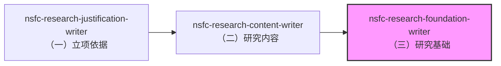

# nsfc-research-foundation-writer

用于 NSFC 标书正文 `（三）研究基础` 的写作/重构，并**同时编排**：

- `3.2 工作条件`
- `3.1 中的研究风险应对`

目标是用"证据链"证明做得成，并把条件与风险对位到研究内容。

## 技能依赖关系

本技能属于 NSFC 申请书写作流程的一部分，建议按以下顺序使用：



**推荐顺序**：
1. **先写（一）立项依据**：使用 `nsfc-research-justification-writer`
2. **再写（二）研究内容**：使用 `nsfc-research-content-writer`
3. **最后写（三）研究基础**：使用本技能

**原因**：
- `3.2 工作条件` 需要与 `2.1` 研究内容的关键任务对齐
- 风险应对需要与 `2.3` 年度研究计划兼容
- 研究基础需要证明"有能力完成研究内容"

**如果必须跳过前置步骤**：
- 请手动提供 `2.1` 和 `2.3` 的内容，以便 AI 进行一致性校验
- 或者在完成 `2.1` 和 `2.3` 后，重新使用本技能进行校验和调整

## 快速开始

### 1. 准备项目
确保你的 NSFC 项目在 `projects/NSFC_Young`（或其他路径）

### 2. 准备信息表
按照 [references/info_form.md](references/info_form.md) 准备以下信息：
- 前期基础（证据链素材）
- 团队与分工
- 条件与资源
- 风险清单（至少 3 条）

### 3. 执行技能
```
请使用 nsfc-research-foundation-writer：
目标项目：projects/NSFC_Young
信息表：<按 references/info_form.md 提供>
输出：写入 extraTex/3.1.研究基础.tex、extraTex/3.2.工作条件.tex
额外要求：风险应对至少 3 条，每条要有早期信号与备选方案
output_mode：apply（默认）/ preview（只预览不写入）
```

## 输出文件

- `extraTex/3.1.研究基础.tex`：研究基础 + 风险应对
- `extraTex/3.2.工作条件.tex`：工作条件

## 输出示例

见 [references/example_output.md](references/example_output.md)

## 注意事项

- 本技能只修改 `extraTex/3.*.tex` 文件，不会修改 `main.tex` 或模板文件
- 风险应对至少需要 3 条（技术/进度/资源各至少 1 条）
- 工作条件必须与 `2.1` 研究内容的关键任务对齐

## 可选自检（只读）

- 仅校验 skill 自身一致性：`python3 skills/nsfc-research-foundation-writer/scripts/validate_skill.py`
- 同时检查某个项目的输出文件：`python3 skills/nsfc-research-foundation-writer/scripts/run_checks.py --project-root projects/NSFC_Young`
