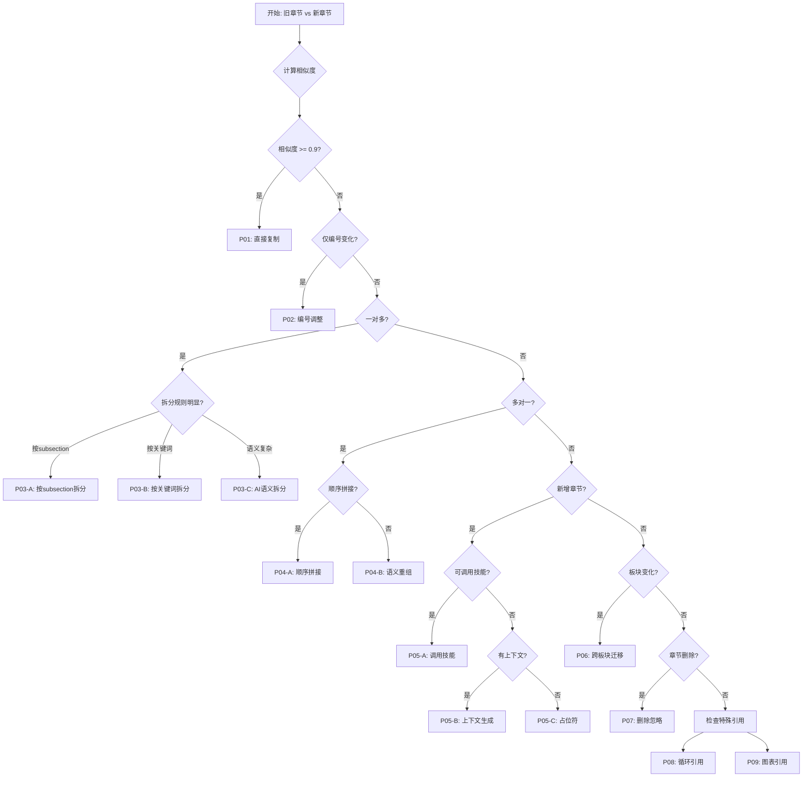

# 常见迁移模式库

**文档版本**: v1.0
**最后更新**: 2026-01-05
**适用范围**: NSFC 标书版本迁移

---

## 📋 目录

1. [模式概览](#模式概览)
2. [标准迁移模式](#标准迁移模式)
3. [复杂迁移模式](#复杂迁移模式)
4. [特殊场景模式](#特殊场景模式)
5. [模式应用指南](#模式应用指南)

---

## 模式概览

### 模式分类矩阵

| 模式ID | 名称 | 复杂度 | 适用场景 | 频率 |
|--------|------|--------|----------|------|
| P01 | 直接复制模式 | ⭐ | 标题几乎相同，内容完全一致 | 40% |
| P02 | 编号调整模式 | ⭐ | 仅章节编号变化 | 25% |
| P03 | 语义拆分模式 | ⭐⭐⭐ | 一章拆分为多章 | 15% |
| P04 | 智能合并模式 | ⭐⭐ | 多章合并为一章 | 8% |
| P05 | 上下文生成模式 | ⭐⭐⭐ | 新增章节需要生成 | 7% |
| P06 | 跨板块迁移模式 | ⭐⭐⭐ | 章节所属板块变化 | 3% |
| P07 | 删除忽略模式 | ⭐ | 旧章节在新模板中不存在 | 2% |

---

## 标准迁移模式

### P01: 直接复制模式

**场景**: 章节标题和内容基本不变，仅需复制

**特征**:
- 标题相似度 ≥ 0.9
- 内容结构完全相同
- 无需调整层级

**示例**:
```
旧: extraTex/1.3.研究目标.tex
新: extraTex/2.2.研究目标.tex
```

**实现**:
```python
def pattern_p01_direct_copy(old_file, new_file):
    """
    P01: 直接复制模式
    """
    # 读取源文件
    with open(old_file, 'r', encoding='utf-8') as f:
        content = f.read()

    # 基础清理
    content = clean_latex_comments(content)
    content = normalize_whitespace(content)

    # 写入目标文件
    with open(new_file, 'w', encoding='utf-8') as f:
        f.write(content)

    return {
        'pattern': 'P01',
        'status': 'success',
        'word_count': count_chinese_words(content)
    }
```

**检查清单**:
- [ ] 源文件存在
- [ ] 源文件非空
- [ ] LaTeX语法有效
- [ ] 编译无错误

---

### P02: 编号调整模式

**场景**: 仅章节编号格式变化，内容不变

**特征**:
- 标题内容相同，编号格式不同
- 如 "1.1" → "1." 或 "（一）"
- 正文内容完全相同

**示例**:
```
旧: \subsection{1.1 项目的立项依据}
新: \subsection{1. 项目的立项依据}
```

**实现**:
```python
def pattern_p02_number_adjust(old_file, new_file, old_number, new_number):
    """
    P02: 编号调整模式
    """
    with open(old_file, 'r', encoding='utf-8') as f:
        content = f.read()

    # 更新标题中的编号（如果有）
    # 注意：通常模板会自动处理标题编号，这里主要是更新正文中的引用

    # 更新正文中的章节编号引用
    content = re.sub(
        rf'第{old_number}节',
        f'第{new_number}节',
        content
    )

    with open(new_file, 'w', encoding='utf-8') as f:
        f.write(content)

    return {
        'pattern': 'P02',
        'status': 'success',
        'number_changed': f'{old_number} → {new_number}'
    }
```

**注意事项**:
- ⚠️ 不要修改 `\section{}` 或 `\subsection{}` 标题本身
- ⚠️ 只修改正文中的编号引用
- ⚠️ 模板会自动处理标题编号

---

## 复杂迁移模式

### P03: 语义拆分模式

**场景**: 一个章节拆分为多个章节

**特征**:
- 旧章节包含多个子主题
- 新模板将子主题独立成章
- 需要识别语义边界

**子模式**:

#### P03-A: 按 `\subsection{}` 边界拆分

**示例**:
```latex
% 旧文件: extraTex/1.5.研究方案.tex
\subsection{研究方法}
...
\subsection{技术路线}
...
\subsection{可行性分析}
...
```

**拆分为**:
```latex
% 新文件1: extraTex/3.1.研究方案.tex
\subsection{研究方法}
...
\subsection{技术路线}
...

% 新文件2: extraTex/3.2.可行性分析.tex
\subsection{可行性分析}
...
```

**实现**:
```python
def pattern_p03a_split_by_subsection(old_file, new_files, split_points):
    """
    P03-A: 按\subsection{}边界拆分
    """
    with open(old_file, 'r', encoding='utf-8') as f:
        content = f.read()

    # 按拆分点切分
    parts = []
    for i, point in enumerate(split_points):
        if i == 0:
            part = content[:content.find(point)]
        elif i == len(split_points) - 1:
            part = content[content.find(split_points[i-1]):]
        else:
            part = content[content.find(split_points[i-1]):content.find(point)]
        parts.append(part)

    # 写入新文件
    for new_file, part in zip(new_files, parts):
        # 添加必要的文件头
        part = add_file_header(part, new_file)

        with open(new_file, 'w', encoding='utf-8') as f:
            f.write(part)

    return {
        'pattern': 'P03-A',
        'status': 'success',
        'split_count': len(new_files)
    }
```

#### P03-B: 按关键词拆分

**示例**:
```python
# 在"研究方案"中找到"可行性分析"关键词，从这里拆分
split_marker = "可行性分析"
split_point = content.find(split_marker)
scheme_part = content[:split_point]
feasibility_part = content[split_point:]
```

**实现**:
```python
def pattern_p03b_split_by_keyword(old_file, new_files, keywords):
    """
    P03-B: 按关键词拆分
    """
    with open(old_file, 'r', encoding='utf-8') as f:
        content = f.read()

    # 找到关键词位置
    split_positions = []
    for keyword in keywords:
        pos = content.find(keyword)
        if pos != -1:
            split_positions.append((pos, keyword))

    # 按位置排序
    split_positions.sort()

    # 切分内容
    parts = []
    for i, (pos, keyword) in enumerate(split_positions):
        if i == 0:
            part = content[:pos]
        elif i == len(split_positions) - 1:
            part = content[split_positions[i-1][0]:]
        else:
            part = content[split_positions[i-1][0]:pos]
        parts.append(part)

    # 写入新文件
    for new_file, part in zip(new_files, parts):
        with open(new_file, 'w', encoding='utf-8') as f:
            f.write(part)

    return {
        'pattern': 'P03-B',
        'status': 'success',
        'split_keywords': [kw for _, kw in split_positions]
    }
```

#### P03-C: AI语义拆分

**场景**: 无法用简单规则拆分，需要AI理解语义

**实现**:
```python
def pattern_p03c_ai_semantic_split(old_file, new_files):
    """
    P03-C: AI语义拆分
    """
    with open(old_file, 'r', encoding='utf-8') as f:
        content = f.read()

    # 调用AI分析语义结构
    structure_analysis = ai_analyze_structure(content)

    # 根据语义结构切分
    parts = ai_split_by_semantics(content, structure_analysis)

    # 写入新文件
    for new_file, part in zip(new_files, parts):
        # AI生成过渡段
        if part != parts[0]:  # 第一部分不需要过渡段
            transition = ai_generate_transition(
                previous_part=parts[parts.index(part)-1],
                current_part=part
            )
            part = transition + "\n\n" + part

        with open(new_file, 'w', encoding='utf-8') as f:
            f.write(part)

    return {
        'pattern': 'P03-C',
        'status': 'success',
        'ai_model': 'claude-opus-4-5',
        'split_count': len(new_files)
    }
```

---

### P04: 智能合并模式

**场景**: 多个章节合并为一个章节

**特征**:
- 多个旧章节主题相关
- 新模板将其合并
- 需要添加过渡段

**子模式**:

#### P04-A: 顺序拼接

**示例**:
```
旧: 1.1 立项依据 + 1.2 研究意义
新: 1. 项目的立项依据
```

**实现**:
```python
def pattern_p04a_sequential_merge(old_files, new_file):
    """
    P04-A: 顺序拼接
    """
    contents = []
    for old_file in old_files:
        with open(old_file, 'r', encoding='utf-8') as f:
            contents.append(f.read())

    # 顺序拼接
    merged = contents[0]
    for i, content in enumerate(contents[1:], start=1):
        # 生成过渡段
        transition = generate_transition(
            from_section=extract_title(old_files[i-1]),
            to_section=extract_title(old_files[i])
        )
        merged += "\n\n" + transition + "\n\n" + content

    # 写入新文件
    with open(new_file, 'w', encoding='utf-8') as f:
        f.write(merged)

    return {
        'pattern': 'P04-A',
        'status': 'success',
        'merged_count': len(old_files)
    }
```

**过渡段生成**:
```python
def generate_transition(from_section, to_section):
    """
    生成过渡段
    """
    templates = [
        f"在上述{from_section}的基础上，",
        f"除{from_section}外，",
        f"结合{from_section}的内容，"
    ]

    # 简单模板选择（实际可以用AI生成）
    return templates[0] + f"下面对{to_section}进行阐述。"
```

#### P04-B: 语义重组

**场景**: 不按顺序，而是按逻辑重新组织内容

**实现**:
```python
def pattern_p04b_semantic_reorder(old_files, new_file):
    """
    P04-B: 语义重组
    """
    # 读取所有内容
    contents = []
    for old_file in old_files:
        with open(old_file, 'r', encoding='utf-8') as f:
            contents.append({
                'file': old_file,
                'content': f.read()
            })

    # AI分析语义结构
    structure = ai_analyze_semantic_structure(contents)

    # 按语义重组
    reordered = ai_reorder_by_semantics(contents, structure)

    # 合并内容
    merged = merge_with_smart_transitions(reordered)

    # 写入新文件
    with open(new_file, 'w', encoding='utf-8') as f:
        f.write(merged)

    return {
        'pattern': 'P04-B',
        'status': 'success',
        'reordered': True
    }
```

---

### P05: 上下文生成模式

**场景**: 新增章节，需要基于上下文生成内容

**子模式**:

#### P05-A: 调用写作技能

**示例**:
```
新增: 3.3 研究风险应对
方法: 调用 nsfc-methods-feasibility-writer
```

**实现**:
```python
def pattern_p05a_call_skill(new_file, skill_name, context_sources):
    """
    P05-A: 调用写作技能
    """
    # 提取上下文
    context = extract_context_from_files(context_sources)

    # 调用技能
    generated_content = invoke_skill(
        skill_name,
        prompt=f"基于以下研究方案，撰写风险应对部分：{context}"
    )

    # 写入新文件
    with open(new_file, 'w', encoding='utf-8') as f:
        f.write(generated_content)

    return {
        'pattern': 'P05-A',
        'status': 'success',
        'skill_used': skill_name,
        'word_count': count_chinese_words(generated_content)
    }
```

#### P05-B: 基于上下文生成

**示例**:
```
新增: 1.6 本研究的特色与创新
方法: 从立项依据、研究内容中提取创新点
```

**实现**:
```python
def pattern_p05b_generate_from_context(new_file, context_sources):
    """
    P05-B: 基于上下文生成
    """
    # 提取上下文
    context = extract_context_from_files(context_sources)

    # AI生成内容
    generated_content = ai_generate_content(
        context=context,
        section_title=extract_section_title(new_file),
        requirements=[
            "突出创新性",
            "突出科学价值",
            "突出研究特色"
        ]
    )

    # 写入新文件
    with open(new_file, 'w', encoding='utf-8') as f:
        f.write(generated_content)

    return {
        'pattern': 'P05-B',
        'status': 'success',
        'context_sources': context_sources
    }
```

#### P05-C: 占位符模式

**场景**: 无法生成内容，留空供用户补充

**实现**:
```python
def pattern_p05c_placeholder(new_file, section_title):
    """
    P05-C: 占位符模式
    """
    placeholder = f"""% {section_title}

\\textbf{{[此部分内容需要手动补充]}}

% 建议：
% 1. 参考相关NSFC标书范例
% 2. 咨询导师或合作者
% 3. 调用相关写作技能生成内容
"""

    with open(new_file, 'w', encoding='utf-8') as f:
        f.write(placeholder)

    return {
        'pattern': 'P05-C',
        'status': 'success',
        'is_placeholder': True
    }
```

---

### P06: 跨板块迁移模式

**场景**: 章节从旧板块迁移到新板块

**示例**:
```
旧: (一)研究内容下的"研究基础"
新: (二)研究基础与工作条件（独立板块）
```

**实现**:
```python
def pattern_p06_cross_section_migration(old_file, new_file, old_section, new_section):
    """
    P06: 跨板块迁移模式
    """
    # 读取源文件
    with open(old_file, 'r', encoding='utf-8') as f:
        content = f.read()

    # 更新板块引用（如"在研究内容部分" → "在研究基础部分"）
    content = update_section_references(content, old_section, new_section)

    # 检查是否需要调整结构（如子章节层级）
    content = adjust_hierarchy(content, new_section)

    # 写入新文件
    with open(new_file, 'w', encoding='utf-8') as f:
        f.write(content)

    return {
        'pattern': 'P06',
        'status': 'success',
        'section_changed': f'{old_section} → {new_section}'
    }
```

---

## 特殊场景模式

### P07: 删除忽略模式

**场景**: 旧章节在新模板中不存在

**实现**:
```python
def pattern_p07_ignore(old_file):
    """
    P07: 删除忽略模式
    """
    # 记录被忽略的章节
    log_info(f"章节 {old_file} 在新模板中不存在，已忽略")

    return {
        'pattern': 'P07',
        'status': 'ignored',
        'file': old_file
    }
```

---

### P08: 循环引用处理模式

**场景**: 章节之间互相引用，需要特殊处理

**实现**:
```python
def pattern_p08_circular_reference(files_map):
    """
    P08: 循环引用处理模式
    """
    # 第一步：提取所有引用
    all_refs = {}
    for old_file, new_file in files_map.items():
        with open(old_file, 'r', encoding='utf-8') as f:
            content = f.read()
        refs = extract_references(content)
        all_refs[new_file] = refs

    # 第二步：生成引用映射表
    ref_mapping = generate_reference_mapping(all_refs)

    # 第三步：批量更新引用
    for new_file in files_map.values():
        with open(new_file, 'r', encoding='utf-8') as f:
            content = f.read()

        # 更新引用
        for old_ref, new_ref in ref_mapping.items():
            content = content.replace(f'\\ref{{{old_ref}}}', f'\\ref{{{new_ref}}}')

        # 写回文件
        with open(new_file, 'w', encoding='utf-8') as f:
            f.write(content)

    return {
        'pattern': 'P08',
        'status': 'success',
        'refs_updated': len(ref_mapping)
    }
```

---

### P09: 图表引用处理模式

**场景**: 文件中包含大量图表引用，需要验证文件存在

**实现**:
```python
def pattern_p09_figure_references(file, figures_dir):
    """
    P09: 图表引用处理模式
    """
    with open(file, 'r', encoding='utf-8') as f:
        content = f.read()

    # 提取所有图表引用
    figure_refs = extract_figure_references(content)

    # 检查图表文件是否存在
    missing_figures = []
    for ref in figure_refs:
        figure_path = Path(figures_dir) / ref
        if not figure_path.exists():
            missing_figures.append(ref)
            # 生成占位符
            content = content.replace(
                f'\\ref{{{ref}}}',
                f'\\textbf{{[图表缺失: {ref}]}}'
            )

    # 写回文件
    with open(file, 'w', encoding='utf-8') as f:
        f.write(content)

    return {
        'pattern': 'P09',
        'status': 'success',
        'total_refs': len(figure_refs),
        'missing_refs': len(missing_figures),
        'missing_list': missing_figures
    }
```

---

## 模式应用指南

### 模式选择决策树



### 模式组合示例

**场景**: 复杂迁移，需要组合多个模式

```python
# 示例：研究方案章节迁移
def complex_migration_example():
    """
    复杂迁移示例：研究方案 → 研究方案 + 可行性分析
    """
    # 第一步：P03-A 拆分章节
    pattern_p03a_split_by_subsection(
        old_file='old/extraTex/1.5.研究方案.tex',
        new_files=[
            'new/extraTex/3.1.研究方案.tex',
            'new/extraTex/3.2.可行性分析.tex'
        ],
        split_points=['\\subsection{可行性分析}']
    )

    # 第二步：P08 处理交叉引用
    pattern_p08_circular_reference({
        'old/extraTex/1.5.研究方案.tex': 'new/extraTex/3.1.研究方案.tex',
        ...
    })

    # 第三步：P05-A 生成新增的"风险应对"章节
    pattern_p05a_call_skill(
        new_file='new/extraTex/3.3.研究风险应对.tex',
        skill_name='nsfc-methods-feasibility-writer',
        context_sources=['new/extraTex/3.2.可行性分析.tex']
    )

    return {
        'status': 'success',
        'patterns_used': ['P03-A', 'P08', 'P05-A']
    }
```

---

## 附录: 模式速查表

| 模式ID | 名称 | 输入 | 输出 | 复杂度 |
|--------|------|------|------|--------|
| P01 | 直接复制 | 1文件 | 1文件 | ⭐ |
| P02 | 编号调整 | 1文件 | 1文件 | ⭐ |
| P03-A | 按subsection拆分 | 1文件 | N文件 | ⭐⭐ |
| P03-B | 按关键词拆分 | 1文件 | N文件 | ⭐⭐ |
| P03-C | AI语义拆分 | 1文件 | N文件 | ⭐⭐⭐ |
| P04-A | 顺序拼接 | N文件 | 1文件 | ⭐⭐ |
| P04-B | 语义重组 | N文件 | 1文件 | ⭐⭐⭐ |
| P05-A | 调用技能 | 上下文 | 1文件 | ⭐⭐⭐ |
| P05-B | 上下文生成 | 上下文 | 1文件 | ⭐⭐ |
| P05-C | 占位符 | 无 | 1文件 | ⭐ |
| P06 | 跨板块迁移 | 1文件 | 1文件 | ⭐⭐⭐ |
| P07 | 删除忽略 | 1文件 | 无 | ⭐ |
| P08 | 循环引用 | N文件 | N文件 | ⭐⭐ |
| P09 | 图表引用 | 1文件 | 1文件 | ⭐⭐ |

---

**文档版本**: v1.0
**最后更新**: 2026-01-05
**维护者**: transfer-old-latex-to-new 技能组
