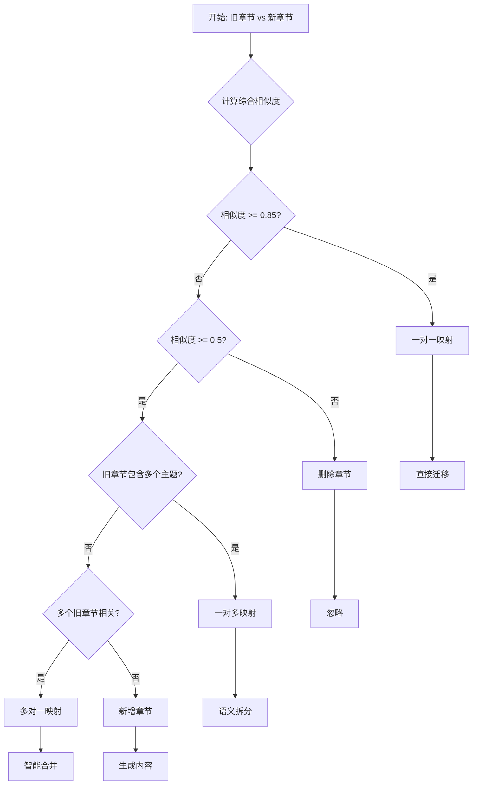

# 章节映射决策参考指南

**文档版本**: v1.0
**最后更新**: 2026-01-05
**适用范围**: 所有 NSFC 模板版本迁移

---

## 📋 目录

1. [映射类型分类](#映射类型分类)
2. [相似度计算方法](#相似度计算方法)
3. [决策树](#决策树)
4. [常见场景与决策](#常见场景与决策)
5. [边缘情况处理](#边缘情况处理)

---

## 映射类型分类

### 类型1: 一对一映射 (One-to-One)

**定义**: 旧章节直接对应到新章节，结构内容基本不变

**特征**:
- 章节标题相似度 ≥ 0.85
- 内容语义高度重合
- 位置顺序基本一致

**示例**:
```
旧: 1.1 项目的立项依据
新: 1. 项目的立项依据
相似度: 0.95
映射类型: one_to_one
```

**迁移策略**:
- 直接复制内容
- 检查LaTeX语法
- 更新引用标签

**风险**: 低

---

### 类型2: 一对多映射 (One-to-Many)

**定义**: 一个旧章节拆分为多个新章节

**特征**:
- 旧章节标题包含多个主题
- 新模板将相关主题独立成章
- 旧章节内容篇幅较长

**示例**:
```
旧: 1.5 研究方案
  ├── 研究方法
  ├── 技术路线
  └── 可行性分析

新: 3.1 研究方案
  ├── 研究方法
  └── 技术路线

新: 3.2 可行性分析
  └── 可行性分析
```

**迁移策略**:
- **语义边界识别**: 找到自然的拆分点（通常是 `\subsection{}` 边界）
- **内容拆分**: 按主题将内容分配到对应文件
- **过渡段生成**: 在拆分点添加衔接段落

**拆分方法优先级**:
1. **按 `\subsection{}` 边界拆分** (最优先)
2. **按关键词出现位置拆分**
3. **按段落边界拆分**
4. **AI语义分析后拆分**

**风险**: 中-高（取决于拆分点的准确性）

---

### 类型3: 多对一映射 (Many-to-One)

**定义**: 多个旧章节合并为一个新章节

**特征**:
- 多个旧章节主题相关性强
- 新模板将相关章节合并
- 旧章节内容篇幅较短

**示例**:
```
旧: 1.1 立项依据
旧: 1.2 研究意义

新: 1. 项目的立项依据
  (包含：立项依据 + 研究意义)
```

**迁移策略**:
- **顺序拼接**: 按源文件顺序合并内容
- **过渡段生成**: 在合并点添加衔接段落
- **去重处理**: 删除重复的引言或总结

**合并方法优先级**:
1. **顺序拼接 + 过渡段** (最优先)
2. **语义重新排序后合并**
3. **AI智能重组内容**

**风险**: 中（过渡段质量影响逻辑连贯性）

---

### 类型4: 新增章节 (New Added)

**定义**: 新模板有，旧模板没有的章节

**特征**:
- 新模板明确要求
- 旧模板无对应内容
- 需要AI生成或手动补充

**示例**:
```
新: 3.3 研究风险应对
来源: 无（需要生成）
```

**迁移策略**:
- **从上下文提取**: 从相关章节提取信息
- **调用写作技能**: 使用 NSFC 写作技能生成
- **占位符**: 生成占位符供后续补充

**生成策略优先级**:
1. **调用写作技能** (最优先)
2. **基于上下文生成**
3. **生成占位符**

**风险**: 中-高（生成内容质量需验证）

---

### 类型5: 删除章节 (Removed)

**定义**: 旧模板有，新模板没有的章节

**特征**:
- 新模板不再要求
- 内容可忽略或迁移到其它章节

**示例**:
```
旧: 3.5 其它
新: 无（内容可忽略）
```

**迁移策略**:
- **忽略**: 直接跳过
- **迁移到其它章节**: 如果内容有价值，迁移到相关章节

**风险**: 低

---

## 相似度计算方法

### 综合相似度公式

```python
综合相似度 = w1*标题相似度 + w2*内容相似度 + w3*位置相似度 + w4*结构相似度

其中:
w1 = 0.4  # 标题相似度权重
w2 = 0.3  # 内容相似度权重
w3 = 0.2  # 位置相似度权重
w4 = 0.1  # 结构相似度权重
```

### 1. 标题相似度 (Title Similarity)

**计算方法**: Levenshtein 距离

```python
def title_similarity(old_title, new_title):
    """
    计算两个标题的编辑距离相似度
    """
    import Levenshtein

    # 去除编号和特殊字符
    old_clean = re.sub(r'^[\d.（）]+\s*', '', old_title)
    new_clean = re.sub(r'^[\d.（）]+\s*', '', new_title)

    # 计算编辑距离
    distance = Levenshtein.distance(old_clean, new_clean)
    max_len = max(len(old_clean), len(new_clean))

    similarity = 1 - (distance / max_len)
    return similarity
```

**示例**:
```python
title_similarity("1.1 项目的立项依据", "1. 项目的立项依据")
# 输出: 0.95

title_similarity("1.5 研究方案", "3.1 研究方案")
# 输出: 0.75（"研究方案"相同，但编号不同）
```

### 2. 内容相似度 (Content Similarity)

**计算方法**: 词向量余弦相似度

```python
def content_similarity(old_file, new_file):
    """
    计算两个文件的语义相似度
    """
    from sentence_transformers import SentenceTransformer

    # 加载中文预训练模型
    model = SentenceTransformer('paraphrase-multilingual-MiniLM-L12-v2')

    # 读取文件前100字作为摘要
    with open(old_file, 'r', encoding='utf-8') as f:
        old_content = extract_first_100_chars(f.read())
    with open(new_file, 'r', encoding='utf-8') as f:
        new_content = extract_first_100_chars(f.read())

    # 计算嵌入向量
    old_embedding = model.encode(old_content)
    new_embedding = model.encode(new_content)

    # 余弦相似度
    from sklearn.metrics.pairwise import cosine_similarity
    similarity = cosine_similarity([old_embedding], [new_embedding])[0][0]

    return similarity
```

### 3. 位置相似度 (Position Similarity)

**计算方法**: 基于章节顺序的接近度

```python
def position_similarity(old_index, new_index, old_total, new_total):
    """
    计算章节位置的相似度
    """
    # 归一化索引
    old_norm = old_index / old_total
    new_norm = new_index / new_total

    # 计算距离
    distance = abs(old_norm - new_norm)

    # 转换为相似度
    similarity = 1 - distance
    return similarity
```

**示例**:
```python
# 旧版第3个章节 vs 新版第3个章节
position_similarity(3, 3, 10, 10)
# 输出: 1.0（位置完全相同）

# 旧版第2个章节 vs 新版第8个章节
position_similarity(2, 8, 10, 10)
# 输出: 0.4（位置差异较大）
```

### 4. 结构相似度 (Structure Similarity)

**计算方法**: 基于章节层级结构的一致性

```python
def structure_similarity(old_section, new_section):
    """
    计算章节结构的相似度
    """
    # 检查层级是否相同
    level_match = 1 if old_section['level'] == new_section['level'] else 0.5

    # 检查是否有子章节
    has_children_match = 1 if (
        (old_section.get('subsections') and new_section.get('subsections')) or
        (not old_section.get('subsections') and not new_section.get('subsections'))
    ) else 0.5

    # 子章节数量相似度
    old_children_count = len(old_section.get('subsections', []))
    new_children_count = len(new_section.get('subsections', []))
    children_similarity = 1 - abs(old_children_count - new_children_count) / max(old_children_count, new_children_count, 1)

    # 综合评分
    similarity = (level_match * 0.4 + has_children_match * 0.3 + children_similarity * 0.3)
    return similarity
```

---

## 决策树



### 决策规则实现

```python
def decide_mapping_type(old_section, new_section, similarity):
    """
    决策映射类型
    """
    if similarity >= 0.85:
        return {
            'type': 'one_to_one',
            'confidence': 'high',
            'action': 'direct_copy'
        }

    elif similarity >= 0.5:
        # 判断是否需要拆分
        if has_multiple_topics(old_section):
            return {
                'type': 'one_to_many',
                'confidence': 'medium',
                'action': 'semantic_split'
            }
        # 判断是否需要合并
        elif is_related_to_multiple_sections(new_section):
            return {
                'type': 'many_to_one',
                'confidence': 'medium',
                'action': 'smart_merge'
            }
        else:
            # 相似度中等，可能是标题变化但内容相同
            return {
                'type': 'one_to_one',
                'confidence': 'low',
                'action': 'direct_copy_with_review'
            }

    else:
        # 相似度低，可能是新增或删除
        if new_section and not old_section:
            return {
                'type': 'new_added',
                'confidence': 'high',
                'action': 'generate_content'
            }
        elif old_section and not new_section:
            return {
                'type': 'removed',
                'confidence': 'high',
                'action': 'ignore'
            }
        else:
            return {
                'type': 'unknown',
                'confidence': 'low',
                'action': 'manual_review_required'
            }
```

---

## 常见场景与决策

### 场景1: 标题微调，内容相同

**示例**:
```
旧: 1.1 项目的立项依据
新: 1. 项目的立项依据
```

**决策**:
```python
{
    'type': 'one_to_one',
    'similarity': 0.95,
    'action': 'direct_copy',
    'note': '标题仅编号格式变化，内容相同'
}
```

---

### 场景2: 一个章节拆分为两个

**示例**:
```
旧: 1.5 研究方案
新: 3.1 研究方案, 3.2 可行性分析
```

**决策**:
```python
{
    'type': 'one_to_many',
    'targets': ['3.1', '3.2'],
    'split_strategy': 'subsection_boundary',
    'action': 'split_at_subsection',
    'split_marker': '\\subsection{可行性分析}',
    'note': '按\\subsection{}边界拆分'
}
```

---

### 场景3: 多个章节合并为一个

**示例**:
```
旧: 1.1 立项依据, 1.2 研究意义
新: 1. 项目的立项依据
```

**决策**:
```python
{
    'type': 'many_to_one',
    'sources': ['1.1', '1.2'],
    'merge_strategy': 'sequential_merge',
    'action': 'merge_with_transition',
    'transition_template': '在上述研究意义的基础上，本项目的立项依据如下：',
    'note': '顺序拼接，添加过渡段'
}
```

---

### 场景4: 新增章节

**示例**:
```
新: 3.3 研究风险应对
旧: 无对应
```

**决策**:
```python
{
    'type': 'new_added',
    'target': '3.3',
    'generation_method': 'call_skill',
    'skill': 'nsfc-methods-feasibility-writer',
    'context_sources': ['3.2 可行性分析'],
    'prompt_template': '基于以下可行性分析，识别潜在风险并给出应对措施：{context}',
    'note': '调用写作技能生成'
}
```

---

### 场景5: 删除章节

**示例**:
```
旧: 3.5 其它
新: 无
```

**决策**:
```python
{
    'type': 'removed',
    'action': 'ignore',
    'note': '新模板不再要求此章节'
}
```

---

## 边缘情况处理

### 情况1: 标题完全不同，但内容相似

**示例**:
```
旧: 1.3 研究目标
新: 2.2 预期目标
```

**处理**:
```python
# 提高内容相似度权重
content_sim = calculate_content_similarity(old, new)  # 假设为 0.9
if content_sim >= 0.85:
    return {
        'type': 'one_to_one',
        'confidence': 'medium',
        'action': 'direct_copy',
        'note': '标题不同但内容高度相似'
    }
```

---

### 情况2: 相似度在边界值（0.7-0.85）

**示例**:
```
综合相似度 = 0.78
```

**处理**:
```python
# 需要AI进一步推理
if 0.7 <= similarity < 0.85:
    # 调用AI进行语义分析
    ai_decision = ai_semantic_analysis(old_section, new_section)
    return ai_decision
```

**AI分析要点**:
- 读取两个文件的前200字
- 判断主题是否一致
- 检查关键词重叠度
- 给出最终决策

---

### 情况3: 循环引用（章节互相引用）

**示例**:
```latex
% extraTex/1.1.立项依据.tex
参见研究内容\ref{sec:content}...

% extraTex/1.2.研究内容.tex
基于立项依据\ref{sec:rationale}...
```

**处理**:
```python
# 第一步：迁移内容，保留原引用
# 第二步：更新引用映射表
ref_mapping = {
    'sec:content': 'sec:2.1_content',
    'sec:rationale': 'sec:1_rationale'
}
# 第三步：批量替换引用
```

---

### 情况4: 空章节或占位符章节

**示例**:
```latex
% extraTex/1.6.其它.tex
\textbf{[此部分内容待补充]}
```

**处理**:
```python
if is_placeholder(content):
    return {
        'type': 'placeholder',
        'action': 'skip',
        'note': '源文件为占位符，跳过迁移'
    }
```

---

### 情况5: 包含大量图表引用

**示例**:
```latex
参见实验结果图\ref{fig:result}...
```

**处理**:
```python
# 提取所有图表引用
figure_refs = extract_figure_references(content)

# 检查图表文件是否存在
for ref in figure_refs:
    if not figure_file_exists(ref):
        log_warning(f"图表文件不存在: {ref}")
        # 生成占位符
        content = content.replace(f"\\ref{{{ref}}}", "\\textbf{[图表缺失]}")

# 迁移内容
return content
```

---

## 附录: 快速决策表

| 旧章节 | 新章节 | 相似度 | 映射类型 | 行动 |
|--------|--------|--------|----------|------|
| 1.1 立项依据 | 1. 立项依据 | 0.95 | one_to_one | 直接复制 |
| 1.5 研究方案 | 3.1 研究方案 | 0.65 | one_to_many | 拆分 |
| 1.1+1.2 | 1. 立项依据 | 0.70 | many_to_one | 合并 |
| - | 3.3 风险应对 | 0.00 | new_added | 生成 |
| 3.5 其它 | - | 0.00 | removed | 忽略 |

---

**文档版本**: v1.0
**最后更新**: 2026-01-05
**维护者**: transfer-old-latex-to-new 技能组
